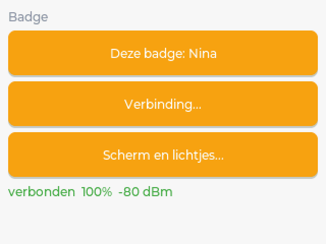
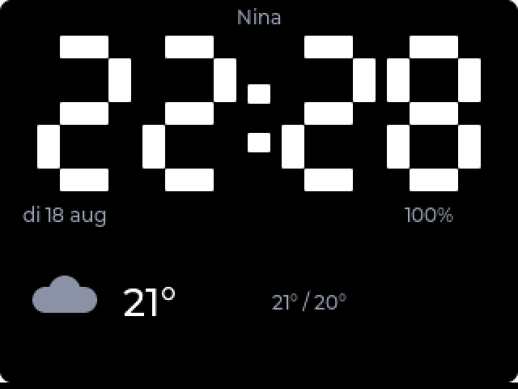
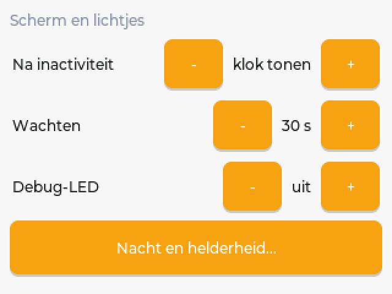
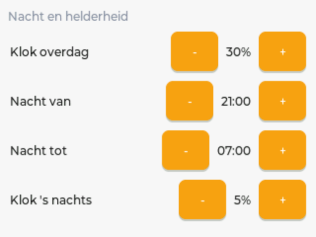

# fri3d-apps

Apps for the [Fri3d Camp](https://fri3d.be) badge, which runs
[MicroPythonOS](https://micropythonos.com) on an ESP32-S3.

Everything here is developed and tested against the **Fri3d 2026 badge**
(hardware id `fri3d_2026`, 320x240 touchscreen, MicroPython 1.27).

## Apps

### Pomodoro — `tech.weyn.pomodoro`

A focus timer on your badge. Work, break, work, break, and a longer break every
fourth round.


Built for a badge sitting on a desk, which shapes most of the design.

- **A countdown you can read from across the room.** Seven-segment digits drawn
  with LVGL rectangles, filling most of the screen. The largest font compiled
  into this firmware is `montserrat_28`, far too small at desk distance, so the
  digits are drawn rather than typeset.
- **LEDs that run out like sand.** All five lit at the start of a phase, one
  fewer as each fifth passes, and the last one breathing so you feel the end
  approaching. You read it out of the corner of your eye without looking away
  from what you are doing.
- **Red means focus, green means break.** That is also the signal to anyone
  walking up to your desk about whether they are interrupting.
- **A paused timer is visibly paused**, one breathing amber LED, rather than
  indistinguishable from switched off.
- **Three distinct chimes.** Rising when you are freed, falling when you are
  called back, and its own tone for the end of a long break, so you know what
  happened without looking.
- **Configurable durations**, plus LED brightness and chime volume, because a
  device at arm's length needs different levels than one on a lanyard. Settings
  survive a reboot.
- **A daily counter.** How many pomodoros you finished today, reset at midnight.
- **The S button starts and pauses**, regardless of where the focus is, so you
  can reach over and hit it without looking away from your work.
- **Touch and keys.** On-screen buttons, and the same buttons reachable with the
  badge's d-pad because they sit in the default LVGL focus group.
- **Auto-start**, off by default, to chain phases without touching the badge.

| Control | What it does |
| --- | --- |
| **S button** | Start or pause, wherever the focus is |
| Start / Pause | Run or hold the current phase |
| Reset | Back to the full length of the current phase |
| Skip | Jump to the next phase without an alert |
| Gear | Durations, rounds, sound, LEDs, auto-start |

The phase colour carries through the title, the digits, the progress bar and
the LEDs: red for focus, green for a short break, blue for a long one.

Known limitation: the timer only runs while the app is in the foreground.
Switch to another app and it stops. Moving it into a MicroPythonOS Service is
the next piece of work.

### Berichtjes — `tech.weyn.messages`

Call the kids for dinner without shouting up the stairs.

You press a button in Home Assistant, the badge in their room chimes, blinks and
shows the message. They tap once, and the dashboard turns green so you know it
landed. Built because "dinner in ten minutes" shouted from the hallway has a
delivery rate somewhere around 40 percent.

<p>


</p>

The on-screen text is Dutch (`Geen berichten`, `Nieuw bericht!`, `Ontvangen!`,
`gestuurd om 18:42`). Everything else, including the Home Assistant examples, is
in English. Changing the four strings in `messages.py` is a five minute job if
you want another language.

**What you need:** a Fri3d 2026 badge, Home Assistant, and an MQTT broker they
can both reach, normally the Mosquitto add-on. One badge works fine; the design
assumes several.

**Setup, both sides, is in
[docs/berichtjes-homeassistant/](docs/berichtjes-homeassistant/).** Twenty
minutes, most of it pasting YAML.

#### How it behaves

- **A background service, not a screen.** A `boot_completed` Service listens
  whatever is on screen, so a message arrives while the child is playing a game.
  It posts a notification, blinks the LEDs, wakes the screen if it had gone dark,
  and pulls the app to the front.
- **It borrows the connection.** The MQTT link, the broker settings and the name
  of the badge live in the [Badge app](#badge--techweynbadgecontroller), because they
  describe the badge and not this app. One badge, one connection. If that app is
  not running the screen says `geen Badge-app` rather than `geen verbinding`:
  those call for different repairs.
- **The same message twice is two messages.** Comparing incoming text with the
  last one is the obvious way to avoid duplicates, and it swallows exactly the
  message you care about: the second "dinner in ten minutes" of the evening.
  Messages carry a sequence number instead.
- **Shows when it was sent.** "In ten minutes" means nothing without knowing
  when those ten minutes started. The badge's clock reads UTC even once you set
  the timezone, so the time is converted explicitly, and a badge that never
  reached an NTP server shows no time rather than a confident wrong one.
- **LEDs blink until someone answers**, then stop after half an hour. A light
  flashing in a bedroom all night is worse than a message nobody answered, so
  the nagging gives up while the message stays on screen and acknowledgeable.
- **Honest about the link.** The screen says `geen verbinding` when the service
  is not connected, and an acknowledgement that could not be published says so
  instead of showing a green tick nobody in the kitchen will see. It is held and
  sent when the link returns, and then the screen catches up by itself.
- **Backs off out of range.** A failed connection retries after 2 seconds, then
  4, up to a minute, rather than hammering the radio in a bedroom with no WiFi.
- **Configured on the badge.** How long the LEDs nag, and whether they nag at
  all, sit behind the gear button. The name of this badge and the broker are one
  button further along, in the Badge app.
- **One badge can also send.** A screen of buttons, but only on a badge Home
  Assistant has published a button set to. See below.

#### On the dashboard

Home Assistant publishes to `home/badges/<name>/msg` and the badge answers on
`home/badges/<name>/ack`. Each badge gets a status that is grey when nothing is
running, red the moment you send, green when the child answers, and grey again
after half an hour. Send to everyone and every row turns red, each going green
on its own.


Above: Alice has been sent something and has not answered; Bob has. The rows and
the colours come from
[docs/berichtjes-homeassistant/](docs/berichtjes-homeassistant/) as YAML you can
paste.

That status is a template sensor rather than an automation: a template
containing `now()` is re-rendered every minute, so the fall back to grey happens
by itself, with no timer to survive a restart and nothing arriving on your phone
at dinner time.

#### Sending from a badge

A badge in the kitchen is a better place to call people to dinner from than a
phone you have to unlock. So one badge can carry a screen of buttons.

**The app knows no names and no texts.** Home Assistant publishes what a badge
may send, retained, on `home/badges/<name>/buttons`, and the badge draws
whatever arrives:

```json
{"title": "Call", "buttons": [
  {"label": "15 min", "target": "alice", "text": "Dinner within 15 minutes", "figure": "woman"},
  {"label": "now",    "target": "bob",   "text": "Dinner is ready",          "figure": "man"}
]}
```

That is also the entire on/off switch. A badge nobody publishes to has no send
button at all, so giving one node buttons is one publish rather than a setting
on every device. Changing the buttons is another publish; nothing is
reinstalled, and no name of anybody's child is ever in this repository.

A press puts a request on `home/badges/<name>/send`, and an automation turns
that into the same script the dashboard calls. Publishing straight to the other
badge's `msg` topic would work and would skip Home Assistant, and then the
dashboard stays grey: no timestamp, no red, no green. One place decides what
sending means.

The figures are drawn from rectangles rather than loaded from files. This
firmware's symbol font has no people in it, and shipping a PNG would mean the
app knowing what "a woman" is. Now the configuration says `figure: woman` and
the app draws four rectangles; what they stand for is decided in Home Assistant.
`symbol` (an LVGL symbol name) and `initial` (one or two characters) are there
for buttons that are not people.

Two refusals worth knowing about. A badge will not send to itself, checked both
when drawing the buttons and when publishing, and again in the automation: a
badge that makes itself beep is never what anyone meant. And a press that cannot
be published is not held for later the way an acknowledgement is. "Dinner in ten
minutes" half an hour late is not a message, it is a lie; the screen says it
failed and you press again.

The YAML for both halves is in
[docs/berichtjes-homeassistant/06-badge-buttons.yaml](docs/berichtjes-homeassistant/06-badge-buttons.yaml).

### Badge — `tech.weyn.badgecontroller`

The plumbing app, and the only one here that is mostly a service. It has three
small settings screens and otherwise stays out of the way, and everything else on
the badge that talks to Home Assistant goes through it.




It exists because the connection, the name of the badge, the device id, the
battery sensors and the screen timeout were all sitting inside the messages app,
and none of them are about messages. They describe the badge.

- **One MQTT connection, borrowed by the others.** Two clients from one device to
  one broker is not a saving to make: a broker evicts the older of two clients
  claiming the same id, and the two then take turns kicking each other off
  forever while it looks exactly like a flaky network. Other apps look this
  service up in `sys.modules` and ask it to subscribe or publish.
- **Subscriptions are by suffix, not by topic.** An app asks for `"msg"` and gets
  `home/badges/<name>/msg`. Rename the badge and it is resubscribed on the new
  topic by itself, which is not true of anything that asked for the full topic.
- **The badge as a device in Home Assistant.** It publishes MQTT discovery for
  its own health, so the sensors appear without you writing anything:


  Charge, voltage and signal strength every five minutes. The discovery is keyed
  on the badge's MAC rather than its name, so renaming a badge updates the
  entities that already exist instead of stranding them and starting a second set
  from zero. A badge that walks out of range or runs flat is marked unavailable
  by the broker through a real last will, rather than showing yesterday's reading
  forever.
- **The screen turns itself off, or shows a clock.** MicroPythonOS has no screen
  timeout and no brightness setting, so this app polls the inactivity counter and
  drives the brightness over the I2C expander. Anything from fifteen seconds to a
  quarter of an hour, or never. After that it either goes dark or leaves a dimmed
  clock with the badge's name, the date, the battery and today's weather. It
  remembers the brightness from before it went dark, so a badge set to 40 does not
  wake up at 100. An app with something to say calls `wake()`, because a message
  on a dark badge is not a message.
- **The clock is an overlay, not an app.** It lives in `lv.layer_top()` above
  whatever is running, so going back is nothing more than removing it. Starting an
  activity would push the foreground app away, and then you have to remember where
  you came from and hope that app survives it. The digits are drawn from
  rectangles: the largest font in this firmware is `montserrat_28` and you do not
  read that from bed.
- **Night is darker, and then dark.** Behind *Nacht en helderheid* you set how
  bright the clock is by day and by night, and between which two hours it is
  night. The window wraps around midnight, so 23 to 7 means 23, 0, 1 through 6.
  Inside it the clock drops to the night level, and ten minutes later it goes out
  altogether. Those ten minutes are `KLOK_UIT_S` in the config file and not a row
  on a settings screen: the clock may appear quickly and the screen may then stay
  on for a good while, which are two very different durations, and one setting for
  both would force a bad choice. A fifth row does not fit.




- **One press of S in the dark, or one touch.** Either brings the clock back for
  ten seconds; a second press or touch returns you to the app underneath. Waking
  a dark badge at three in the morning should show you the time, not an app at
  full brightness, and you get to keep your place. Every button resets the
  inactivity counter exactly like a finger does, so the service watches for that
  counter *falling* rather than reading its value, and consumes that fall before
  it can wake anything. Without that the clock vanished the moment you touched the
  joystick, which is the opposite of what you meant.
- **The joystick dims the clock.** Up is brighter, down is darker, and only while
  the clock is on screen. Which of the two levels you are adjusting depends on
  where you are: at night the night value, by day the day value, so you dim it
  from bed and it is right again the next evening. Not X and B, which would be the
  obvious pair: the board's own driver runs its navigation hook on every press, so
  X is ESC (back one screen) and B is NEXT (focus forward). Hijacking them would
  navigate the app under the clock backwards while you thought you were dimming,
  and that cannot be switched off from here.
- **The buttons are read from the expander, not through LVGL.** The first version
  put the overlay in the focus group so the keys arrived there. That had two
  faults. The board driver fires first, so X and B never reach us intact. And
  remembering which object had focus became a trap: a message arriving rebuilt the
  messages app's screen, our memory pointed at something that no longer existed,
  and after that the d-pad did nothing anywhere on the badge. Reading
  `mpos.io_expander.digital` has neither problem.
- **Weather comes from Home Assistant over MQTT.** One retained message on
  `home/badges/weer`, a topic that does not carry the badge's name because the
  weather does not either. Every badge showing a clock reads the same message. The
  YAML for the Home Assistant side is in
  `tech.weyn.badgecontroller/homeassistant-weer.yaml`. Missing fields are not an
  error, and a message that is not valid JSON leaves the previous one standing: a
  sensor that is briefly unavailable should not empty the clock.
- **Set up on the badge.** Name, broker, port, user and password are typed here
  and stored in SharedPreferences, so every badge runs an identical copy of the
  app and no password has to live in a file. The password is never displayed.
  Editing it starts from an empty field, and leaving it empty keeps what is
  stored.
- **It brings your old settings with it.** A badge that was set up when the
  messages app still owned the connection keeps its name, broker and login. You
  do not retype four fields on a touchscreen.

### Muziek — `tech.weyn.speakers`

Start one of your Spotify playlists on a Sonos speaker, from the badge.

Pick a speaker on the wifi, tap a playlist, and it plays. Transport and volume
are there, and so are the alarms of the chosen speaker: switch them on or off and
move them in five minute steps.

- **The two halves talk to two different systems, and that is not a choice.**
  Spotify's Web API cannot drive Sonos: the speakers are a restricted device
  there and do not even appear in `GET /v1/me/player/devices`. So the badge asks
  Spotify what there is to choose from, and hands the chosen
  `spotify:playlist:` URI to the speaker's own local protocol on port 1400. No
  cloud service sits between the badge and the music.
- **It remembers the speaker you used**, looked back up by uid rather than by
  address, because DHCP moves a speaker and its uid never changes.
- **A speaker that is grouped says so**, and the command goes to the group's
  coordinator, because a follower refuses to play.
- **Two sources for the list.** Your Spotify playlists, and the favourites stored
  in the Sonos system itself. They break independently: one needs a refresh
  token, the other needs nothing. A button switches.
- **Radio is its own button.** Sonos keeps stations and playlists together in
  one favourites list, and a station is not a playlist: queueing one is accepted
  by Sonos and then plays nothing, which looks exactly like a broken favourite.
  Stations go straight to the player instead, and the Radio screen shows only
  those, so VRT 1 in the kitchen is one tap rather than two screens deep.
- **Which Spotify account plays is a property of the Sonos household**, not of
  the badge: the badge only hands over a `spotify:playlist:` URI plus a `cdudn`
  that names the service and the account. A family plan puts several accounts on
  one household, and the account number in that string is the only difference
  between one member's playlists and another's. It is a preference per badge;
  `./tools/sonos_probe.py accounts <ip>` lists the numbers to choose from.
- **Nothing blocks the screen.** Every network call is a coroutine over
  `asyncio.open_connection`, TLS included, because LVGL runs on the same thread
  and a blocking socket freezes the display.

Spotify needs a one-time login on a computer: `tools/spotify_auth.py` does the
PKCE dance and prints a refresh token for `speakers_config.py`. Without it the app
still works, on the Sonos favourites. `tools/sonos_probe.py` is the same protocol
layer as a standalone script, for looking at what a speaker answers without a
badge in the loop.

### Updates — `tech.weyn.updates`

Keeps this badge equal to an app index you publish yourself. Every hour it
fetches `app_index.json`, compares every version in it with what is installed,
and installs whatever is newer. Nothing to tap.

- **The same index and the same `.mpk` packages as the built-in AppStore.**
  `tools/publish.sh` writes it. Nothing here is a private protocol: point the
  built-in AppStore at the same URL and you can browse the store by hand.
- **No state it can get stuck in.** OSUpdate on these badges stalled because a
  single cold DNS miss put it in a `WAITING_WIFI` state that depended on
  `ConnectivityManager.is_wifi_connected()`, and that flag never came back. Here
  a failed check is just a failed check: a minute later it tries again, doubling
  up to the usual hour. There is no flag to reset and no reboot to do.
- **An updated activity runs the next time you open it**, because
  `AppManager.execute_script()` drops the module from `sys.modules` afterwards.
  A service does not: it stays resident until the badge restarts. So the app
  says so instead of pretending the new code is already running.
- **The app on screen is left alone** and picked up an hour later. Rewriting the
  files under a running app is asking for half an app.
- **It reports what it has.** If the Badge app's MQTT bridge is up, the installed
  versions go out retained on `home/badges/<name>/apps`, so Home Assistant can
  show which badge is behind. It only tells; nothing drives the badge from there.

Three buttons: check now, automatic on or off, and the index URL, typed on the
badge itself through the OS input screen.

## Services: the part that keeps running

Three of these apps are not only a screen. A MicroPythonOS **service** is a class
with `onCreate`, `onStart` and `onDestroy` that the OS starts from an intent
filter in `MANIFEST.JSON`, and it keeps running whatever app is in the
foreground:

    "services": [
      {
        "entrypoint": "badge_service.py",
        "classname": "BadgeService",
        "intent_filters": [{"action": "boot_completed"}]
      }
    ]

| App | Service | What it does while you are elsewhere |
| --- | --- | --- |
| Badge | `BadgeService` | Holds the MQTT connection, reports battery and signal, runs the screen and the clock |
| Berichtjes | `MessagesService` | Waits for a message, blinks the LEDs, keeps it until someone acknowledges |
| Updates | `UpdatesService` | Checks the app index every hour and installs what is newer |

Six things about services that cost time to find out, and that every one of these
apps now depends on.

**They share one MicroPython VM and one `sys.modules`.** That is why Berichtjes
can borrow the Badge app's MQTT connection instead of opening a second one. A
plain `import badge_service` does not work, because `sys.path` is
`['lib', '', '.frozen', '/lib']` and one app's folder is not on it. It is
`sys.modules.get("badge_service")`, looked up **every tick and never cached**,
because the order in which services start is not fixed and an app that misses the
bridge once would never find it again.

**A lazy import inside a function does not work either.** Same `sys.path`, and
the working directory is `/`. The clock screen was imported the first time it was
needed, and on the badge that was an `ImportError` no test would ever see. Import
at module level, where the OS still has the app's folder within reach.

**Two clients from one device to one broker is not a saving to make.** A broker
evicts the older of two clients claiming the same id, and the two then take turns
kicking each other off forever, which looks exactly like a flaky network. It cost
months here once. Hence one connection, borrowed.

**Anything you write on a settings screen must be applied, not only stored.** The
activity and the service are separate objects; the service does not notice a
preference changing. Every settings screen here calls back into the service when
it closes.

**Preferences hang off the app id.** Rename an app and every badge in the house
forgets its name, its broker and its password, and someone gets to retype four
fields on a touchscreen. `migrate_prefs()` in `badge_service.py` is the pattern:
walk the older app ids, newest first, and take over the first one that has
anything, once.

**A service does not restart when you update it.** `AppManager.execute_script()`
drops an activity's module from `sys.modules` afterwards, so a new version of a
screen runs the next time you open it. A service stays resident until the badge
reboots. The Updates app says so rather than pretending the new code is already
running.

## Installing an app

**With the [Fri3d-IDE](https://fri3dcamp.github.io/Fri3d-IDE/)**, which is what
most people use. Build the package first:

    ./tools/pack_mpk.sh tech.weyn.pomodoro

That writes `dist/tech.weyn.pomodoro_<version>.mpk`. In the IDE, connect the
badge and choose *Install MPK*. The packager leaves out whatever git ignores, so
a config file holding a password does not travel with the package.

**Over USB with mpremote**, which is faster while developing. With no app named
it installs every app in the repo, since nothing here is more default than
anything else:

    ./badge.sh install                      # all of them
    ./badge.sh install tech.weyn.messages   # just one

**From BadgeHub**, once published: search for the app in the badge's App Store.

## Your own app store

Every badge in the house updating itself when you cut a release needs two
things: a folder somewhere on the network, and the Updates app on the badges.

    ./tools/publish.sh

That builds a `.mpk` for every app, copies it and its icon into the store, and
writes `app_index.json` beside them. It publishes everything, every time: an
index describes the whole store, so publishing one app would either drop the
others or point at packages that were never copied.

The default target is `../homeassistant_config/www/appstore`, because Home
Assistant serves `config/www` at `/local/` without a login, which is exactly
enough for a handful of packages on your own network. Two knobs:

    APPSTORE_DIR=/somewhere/else ./tools/publish.sh
    BASE_URL=http://nas.local/appstore ./tools/publish.sh

The badges poll `<BASE_URL>/app_index.json`. Set that URL once per badge, in the
Updates app under *Index*.

**Renaming an app rolls itself out.** A renamed app is a new app as far as
AppManager is concerned, so the old one stays behind with its own tile in the
launcher and its own service, which starts again at the next boot. For these
apps that means two MQTT clients from one badge, which is exactly the failure
that cost months here once. Name the old id in `MANIFEST.JSON` and Updates
removes it after installing the new one:

    "fullname": "tech.weyn.badgecontroller",
    "replaces": ["be.weyn.badge"]

The field travels into the index by itself, because `publish.sh` copies the
whole manifest. Preferences do not travel: they hang off the app id, so the app
itself carries them over on first import. `migrate_prefs()` in
`badge_service.py` is the pattern, and every renamed app here has one.

**Bump the version in `MANIFEST.JSON` or nothing happens.** Badges compare
versions and nothing else, so an app whose code changed and whose version did
not is invisible to them. `publish.sh` compares the bytes of a package it is
about to overwrite and refuses quietly to let that pass unnoticed: same version,
different contents, and it says so and exits non-zero.

The index is the format of `https://apps.micropythonos.com/app_index.json`, so
the built-in AppStore can read it too. Its backend lives in a preference rather
than in the two radio buttons its settings screen offers:

    from mpos import SharedPreferences
    SharedPreferences("com.micropythonos.appstore").edit().put_string(
        "backend", "github,http://192.168.68.100:8123/local/appstore/app_index.json"
    ).commit()

That gives you the store's own screen, with icons and descriptions, and the
AppStore's boot service will notify you about updates 120 seconds after boot and
then daily. It never installs anything by itself; that is what Updates is for.

## Working on an app

`badge.sh` wraps `mpremote`. Install it once with `pipx install mpremote` or
`pip3 install --user mpremote`.

    ./badge.sh probe            # screen, fonts, inputs, LEDs, audio, build
    ./badge.sh apps             # the app folders in this repo
    ./badge.sh list             # installed and built-in apps
    ./badge.sh install [app..]  # copy to /apps and refresh the launcher
    ./badge.sh reinstall [app..] # remove from the badge first, then copy
    ./badge.sh uninstall <app>  # remove one app
    ./badge.sh wipe             # remove every user-installed app
    ./badge.sh diag [app..]     # why it will not load, with real tracebacks
    ./badge.sh refresh          # rescan /apps
    ./badge.sh reset            # reboot
    ./badge.sh run <file.py>    # run a local script on the badge
    ./badge.sh repl             # MicroPython REPL, ctrl-] to quit

A serial port takes one client at a time, so close the Fri3d-IDE tab before
running these.

`./badge.sh diag` is the one worth knowing about. It lists the installed files,
parses the manifest, reports which `mpos` frameworks and LVGL symbols actually
exist on your firmware, then imports and constructs each activity and prints the
traceback for whatever breaks first. Most load failures are a documented import
that does not exist on this build, and that is what surfaces them.

### Tests without a badge

Everything except the pixels runs on desktop Python against stubs for `lvgl`
and `mpos`:

    python3 tests/test_pomodoro.py      # 73 checks
    python3 tests/test_messages.py      # 246 checks
    python3 tests/test_badge.py         # 2115 checks
    python3 tests/test_speakers.py      # 466 checks
    python3 tests/test_autoupdate.py    # 976 checks

Pomodoro: the phase cycle, pause and resume timing, the day rollover, clamping
in the settings screen, LED cleanup on exit, that the LED hourglass only ever
empties, that a paused timer shows amber, and that chimes are routed to the
buzzer rather than the headset.

Berichtjes: a fake bridge in `sys.modules`, which is also exactly how the app
finds the real one, so the sequence numbering, a held acknowledgement, the LED
timeout and the two different ways of being disconnected are all exercised
without hardware. Plus the settings screens, down to the size of the tap targets,
because sending a CLICKED event proves the callback works and says nothing about
whether a finger can reach it.

Badge: a fake broker that drops the link the way a real one does, so the backoff,
the keepalive, a refused login and a rename that has to clear its own retained
topics are all covered. A fake ADC that is missing, broken, or fine, since each
of those has to leave a message arriving. The screen timeout, including that it
restores the brightness it found. And the order in which the preferences are
migrated, checked by reading the source, because a test that simply calls the
function would not catch the activity that ran first.

Muziek: real Sonos answers, copied verbatim off a live system, including the
double XML escaping that is the trap in updating an alarm. The SOAP calls are
asserted in order, because setting the play mode before the queue is the source
is a UPnP 712 and nothing else tells you.

Updates: a fake index and fake packages, so the whole chain from a URL to an
installed version runs on desktop. A package that does not arrive must not take
the others with it, an app that is on screen must be left alone, and a checkout
that failed must be retried in a minute rather than in an hour, which is the
behaviour that OSUpdate got wrong on this hardware. The backoff is checked by
driving the loop with a fake clock, because the alternative is waiting an hour.

The stubs deliberately mirror the quirks of the real firmware, so the fallback
paths are what gets exercised. They also refuse what the firmware refuses: the
suite greps the app source for the sixteen string methods MicroPython does not
have, since desktop Python answers them happily and the badge does not.

### Letting an agent drive the badge

`tools/mcp/` is an MCP server that exposes the badge over USB, so a coding agent
can install, run and debug on real hardware instead of asking you to paste
terminal output back to it. Run `./tools/mcp/setup.sh` and see
[tools/mcp/README.md](tools/mcp/README.md).

### Screenshots

Every badge picture above came off the device itself. `tools/screenshot.py` runs
on the badge and writes `/tmp/shot.b64`; `tools/shot_to_png.py` turns that into a
PNG on your computer, doubled in size because 320 by 240 is small in a README.

    badge_run_file tools/screenshot.py
    python3 tools/shot_to_png.py shot.b64 docs/images/thing.png

The raw pixels are 153600 bytes, and base64 makes 204800 characters of that,
which is not something you pull through a serial REPL. Three things shrink it by
a factor of thirty: a palette, because a settings screen rarely uses more than
sixty colours even with antialiasing, so six bits replace two bytes; run lengths
of one to three packed into that same byte, because antialiased text is mostly
very short runs; and rows identical to the row above written as a single
character, because a button forty pixels tall is forty times the same row. It
would have been one line with `deflate`, but the module on this firmware only
decompresses.

Print the base64 in numbered lines of 96 and copy the numbers along. A wall of
seven thousand characters with the same letter twenty times in a row is not
something you transcribe reliably by hand, and a numbered line makes a dropped
or doubled one visible immediately instead of at the md5 at the end. Check that
md5 against the badge before making the PNG.

    d = open("/tmp/shot.b64").read()
    for i in range(0, len(d), 96):
        print("%02d|%s" % (i // 96, d[i:i+96]))

`all_layers=True` is not optional for these apps: the Badge app's clock lives in
`lv.layer_top()` and is absent from the capture without it.

Do not navigate by firing `lv.EVENT.CLICKED` from the REPL to reach the screen
you want. Starting an activity from that context wedged the badge here and it
took a power cycle. Tap the button yourself and take the shot after.

## This firmware is not quite the documented one

The MicroPythonOS documentation describes a build that differs from the one
shipped on the Fri3d 2026 badge, and the differences keep the same shape: a
documented import or symbol simply is not there. The ones that cost us time:

1. `import mpos.config` raises. `SharedPreferences` is exported from `mpos`.
2. `lv.ANIM` does not exist, and the label wrap constant is
   `lv.label.LONG_MODE.WRAP` rather than either spelling the docs suggest.
   Resolve LVGL constants across several spellings instead of assuming one.
3. The default audio output is the headset, so a chime you expect from the
   buzzer goes to the headphone jack instead.
4. Sixteen CPython string methods are missing, `capitalize` among them. This is
   the dangerous one: the offline stubs run on real CPython and answer happily,
   so the call passes every desktop check and raises `AttributeError` on the
   badge.
5. `time.localtime()` returns UTC even with the timezone set in Settings.
6. A module-level `NAME = const(...)` is intercepted by the compiler, which then
   demands a constant expression. Call your own helper `const` and the whole
   module dies at import with `SyntaxError: not a constant`, pointing at the
   definition rather than the call.
7. The bundled `requests` chokes on `Transfer-Encoding: chunked`, which plenty of
   devices use.
8. `re.finditer` and `re.findall` are absent, and the engine backtracks
   recursively: a pattern with `[^"]*` over an attribute of a thousand characters
   raises `RuntimeError: maximum recursion depth exceeded`. Parse those by hand.
9. `asyncio.open_connection` does work, TLS included, and it is how you keep the
   screen alive during a network call.
10. `/cache` does not exist, although the filesystem layout names it. Create it
    yourself or write somewhere else.

The list moves as the firmware moves. `from mpos import LightsManager` used to
raise and now works, which is exactly why code here resolves names across both
shapes rather than picking one.

[`docs/micropythonos-notes.md`](docs/micropythonos-notes.md) has the measured
hardware facts and the working API notes. Check `dir()` on the device before
trusting a documented import path.

## The case

A printed case for the badge, and a desk dock it clicks onto magnetically. It
all lives in `case/`, generated from a single OpenSCAD source, with
[its own README](case/README.md) covering every dimension.

The geometry is not redrawn. The outline is cut from the board solid in
`Fri3D_Badge_2026_02.step` in the [hardware repository](https://github.com/Fri3dCamp/badge_2026_hw),
and every component height is read from that same file, per designator. So the
7.0 mm joystick, the 5.0 mm buttons, the 4.5 mm display and the 12.6 mm battery
are measured, not guessed.

Three parts. A back shell, closed on all sides, with four pockets for 6x3 mm
magnets under a 0.8 mm skin. A front plate, stepped: the main deck sits 1.8 mm
above the board so the buttons stand 1.2 mm proud and the joystick 3.5 mm, and
only around the display does it rise to 6.5 mm to form the bezel. A flat deck
above the display would bury every control, which is the whole reason for the
step. And a wedge that holds the badge at 65 degrees on a desk, on the same four
magnets, so the back of the badge stays flat and can carry a belt clip or a wall
mount later.

No screws. The front plate clips on at six separate points along the two long
edges, each a 0.4 mm barb with a 1.6 mm lead-in ramp, and there is a pry slot on
each short end so a spudger gets it off again. `BEAD` at the top of the source
sets how hard it clicks.

Four openings, all in the long edges: audio, USB-C, microSD and the power slide
switch SW4. The short ends, the back and the front are closed. The LoRa antenna
is closed by default; `LORA_PORT = true` opens it, and you need that as soon as
the SMA connector P3 is fitted, because it sticks out 9.5 mm past the board edge
and the case will not close over it.

`case/pdf/` holds two more things at true size: a cover sticker with the button
names taken from the revision 02 schematic, and a drawing of every edge opening
with its dimensions. Both are generated by the scripts next to them.

`./case/build.sh` rebuilds the three STLs and the two PDFs, and runs three
boolean checks that intersect the case with every component volume from the
STEP. All three have to come out empty.

One number is still open. `BADGE_BOTTOM` in the source is the lowest point of
everything hanging under the board, and it is still the value from the STEP,
-19.19 mm, which is where the standoffs end. Measure your own stack with the
cover PCB fitted, put that number in, and the inner floor, the wall and the dock
follow from it. Nothing has been printed yet.

## Layout

    tech.weyn.pomodoro/         an app, in a folder named after its app id
    tech.weyn.messages/         messages from Home Assistant
    tech.weyn.badgecontroller/  the MQTT link, the badge's own sensors, the screen
    tech.weyn.speakers/         Spotify, radio and alarms on the Sonos speakers
    tech.weyn.updates/          keeps the badge equal to your own app index
    badge.sh                    mpremote wrapper
    tools/                      scripts that run on the badge, plus the packager
    tools/publish.sh            builds every .mpk and writes your app_index.json
    tools/screenshot.py         runs on the badge, compresses the screen
    tools/shot_to_png.py        turns that into a PNG on your computer
    tools/mcp/                  MCP server exposing the badge over USB
    tests/                      lvgl and mpos stubs, offline tests
    docs/                       notes on MicroPythonOS and this badge,
                                plus the Home Assistant side of Berichtjes
    docs/images/                the screenshots used above
    case/                       a printed case and desk dock, with its
                                OpenSCAD source and both drawings
    dist/                       built .mpk files, not tracked

An app id is a domain you control, reversed. These are all `tech.weyn.*`, from
`weyn.tech`. They used to be `be.weyn.*`, which claims `weyn.be`, a domain that
does not resolve, and Pomodoro used to be `be.fri3d.pomodoro`, which claims the
camp's domain rather than ours.

Two of the names themselves were wrong as well. `messages` was a fossil from
when the app only called the children to the table; it shows any message Home
Assistant sends, so it is `messages`. And `badge` said nothing: every app here
runs on a badge. That one is `badgecontroller`, the app that owns what the
whole device shares, namely its identity, its one MQTT connection, its sensors
and its screen.

Renaming cost a `replaces` field in each manifest and a preferences migration
in each app. Doing it after publishing anywhere would have cost a great deal
more, which is the only reason it happened on the same day the store did.

Each app that needs secrets keeps them in an untracked `*_config.py` next to a
`*_config.example.py` that is in the repo and empty. All of them are optional:
the badge can be set up on the badge.

Most badge apps live in their own repository, one app each. This one keeps the
apps together because `badge.sh`, the stubs and the hardware notes are shared,
and duplicating them across repositories costs more than it saves. Each app is a
self-contained folder named after its app id, so any of them can be lifted into
its own repository later without touching the code.

## Licence

MIT. See [LICENSE](LICENSE).
