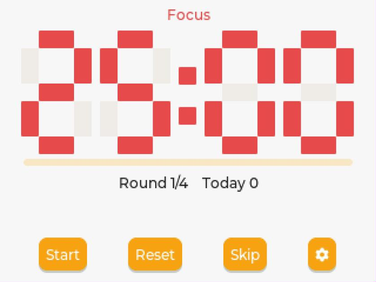
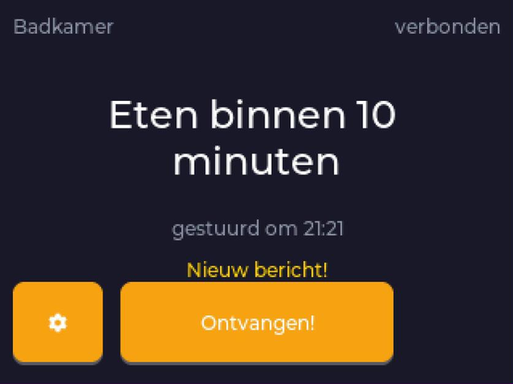
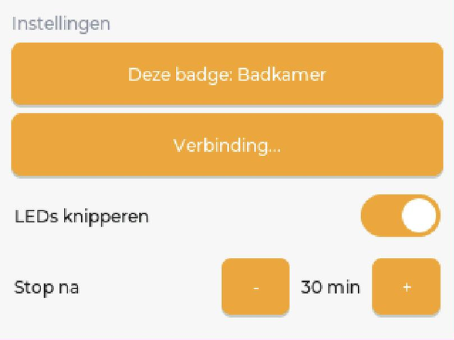
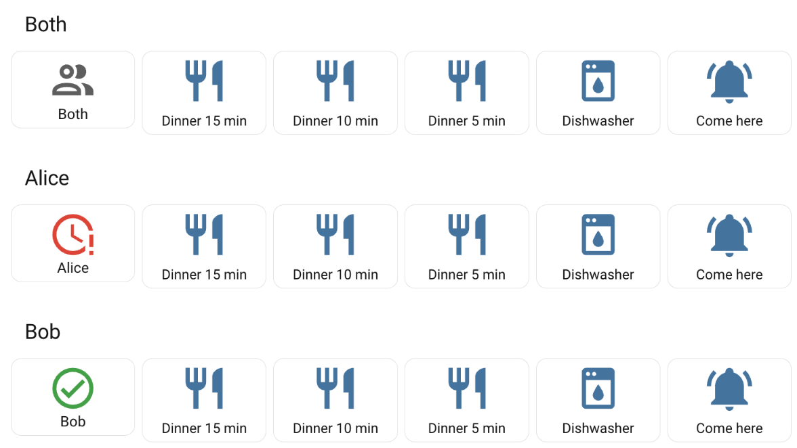
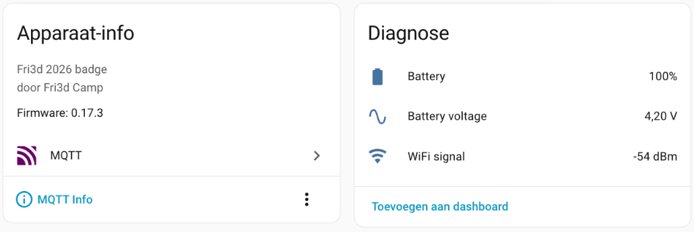

# fri3d-apps

Apps for the [Fri3d Camp](https://fri3d.be) badge, which runs
[MicroPythonOS](https://micropythonos.com) on an ESP32-S3.

Everything here is developed and tested against the **Fri3d 2026 badge**
(hardware id `fri3d_2026`, 320x240 touchscreen, MicroPython 1.27).

## Apps

### Pomodoro — `be.fri3d.pomodoro`

A focus timer on your badge. Work, break, work, break, and a longer break every
fourth round.

Built for a badge sitting on a desk, which shapes most of the design.

- **A countdown you can read from across the room.** Seven-segment digits drawn
  with LVGL rectangles, filling most of the screen. The largest font compiled
  into this firmware is `montserrat_28`, far too small at desk distance, so the
  digits are drawn rather than typeset.
- **LEDs that run out like sand.** All five lit at the start of a phase, one
  fewer as each fifth passes, and the last one breathing so you feel the end
  approaching. You read it out of the corner of your eye without looking away
  from what you are doing.
- **Red means focus, green means break.** That is also the signal to anyone
  walking up to your desk about whether they are interrupting.
- **A paused timer is visibly paused**, one breathing amber LED, rather than
  indistinguishable from switched off.
- **Three distinct chimes.** Rising when you are freed, falling when you are
  called back, and its own tone for the end of a long break, so you know what
  happened without looking.
- **Configurable durations**, plus LED brightness and chime volume, because a
  device at arm's length needs different levels than one on a lanyard. Settings
  survive a reboot.
- **A daily counter.** How many pomodoros you finished today, reset at midnight.
- **The S button starts and pauses**, regardless of where the focus is, so you
  can reach over and hit it without looking away from your work.
- **Touch and keys.** On-screen buttons, and the same buttons reachable with the
  badge's d-pad because they sit in the default LVGL focus group.
- **Auto-start**, off by default, to chain phases without touching the badge.

| Control | What it does |
| --- | --- |
| **S button** | Start or pause, wherever the focus is |
| Start / Pause | Run or hold the current phase |
| Reset | Back to the full length of the current phase |
| Skip | Jump to the next phase without an alert |
| Gear | Durations, rounds, sound, LEDs, auto-start |

The phase colour carries through the title, the digits, the progress bar and
the LEDs: red for focus, green for a short break, blue for a long one.

Known limitation: the timer only runs while the app is in the foreground.
Switch to another app and it stops. Moving it into a MicroPythonOS Service is
the next piece of work.

### Berichtjes — `be.weyn.dinerbadge`

Call the kids for dinner without shouting up the stairs.

You press a button in Home Assistant, the badge in their room chimes, blinks and
shows the message. They tap once, and the dashboard turns green so you know it
landed. Built because "dinner in ten minutes" shouted from the hallway has a
delivery rate somewhere around 40 percent.

The on-screen text is Dutch (`Geen berichten`, `Nieuw bericht!`, `Ontvangen!`,
`gestuurd om 18:42`). Everything else, including the Home Assistant examples, is
in English. Changing the four strings in `dinerbadge.py` is a five minute job if
you want another language.

**What you need:** a Fri3d 2026 badge, Home Assistant, and an MQTT broker they
can both reach, normally the Mosquitto add-on. One badge works fine; the design
assumes several.

**Setup, both sides, is in
[docs/berichtjes-homeassistant/](docs/berichtjes-homeassistant/).** Twenty
minutes, most of it pasting YAML.

#### How it behaves

- **A background service, not a screen.** A `boot_completed` Service listens
  whatever is on screen, so a message arrives while the child is playing a game.
  It posts a notification, blinks the LEDs, wakes the screen if it had gone dark,
  and pulls the app to the front.
- **It borrows the connection.** The MQTT link, the broker settings and the name
  of the badge live in the [Badge app](#badge--beweynbadge), because they
  describe the badge and not this app. One badge, one connection. If that app is
  not running the screen says `geen Badge-app` rather than `geen verbinding`:
  those call for different repairs.
- **The same message twice is two messages.** Comparing incoming text with the
  last one is the obvious way to avoid duplicates, and it swallows exactly the
  message you care about: the second "dinner in ten minutes" of the evening.
  Messages carry a sequence number instead.
- **Shows when it was sent.** "In ten minutes" means nothing without knowing
  when those ten minutes started. The badge's clock reads UTC even once you set
  the timezone, so the time is converted explicitly, and a badge that never
  reached an NTP server shows no time rather than a confident wrong one.
- **LEDs blink until someone answers**, then stop after half an hour. A light
  flashing in a bedroom all night is worse than a message nobody answered, so
  the nagging gives up while the message stays on screen and acknowledgeable.
- **Honest about the link.** The screen says `geen verbinding` when the service
  is not connected, and an acknowledgement that could not be published says so
  instead of showing a green tick nobody in the kitchen will see. It is held and
  sent when the link returns, and then the screen catches up by itself.
- **Backs off out of range.** A failed connection retries after 2 seconds, then
  4, up to a minute, rather than hammering the radio in a bedroom with no WiFi.
- **Configured on the badge.** How long the LEDs nag, and whether they nag at
  all, sit behind the gear button. The name of this badge and the broker are one
  button further along, in the Badge app.

#### On the dashboard

Home Assistant publishes to `home/badges/<name>/msg` and the badge answers on
`home/badges/<name>/ack`. Each badge gets a status that is grey when nothing is
running, red the moment you send, green when the child answers, and grey again
after half an hour. Send to everyone and every row turns red, each going green
on its own.

Above: Alice has been sent something and has not answered; Bob has. The rows and
the colours come from
[docs/berichtjes-homeassistant/](docs/berichtjes-homeassistant/) as YAML you can
paste.

That status is a template sensor rather than an automation: a template
containing `now()` is re-rendered every minute, so the fall back to grey happens
by itself, with no timer to survive a restart and nothing arriving on your phone
at dinner time.

### Badge — `be.weyn.badge`

The plumbing app. It has one small settings screen and otherwise stays out of
the way, and everything else on the badge that talks to Home Assistant goes
through it.

It exists because the connection, the name of the badge, the device id, the
battery sensors and the screen timeout were all sitting inside the messages app,
and none of them are about messages. They describe the badge.

- **One MQTT connection, borrowed by the others.** Two clients from one device to
  one broker is not a saving to make: a broker evicts the older of two clients
  claiming the same id, and the two then take turns kicking each other off
  forever while it looks exactly like a flaky network. Other apps look this
  service up in `sys.modules` and ask it to subscribe or publish.
- **Subscriptions are by suffix, not by topic.** An app asks for `"msg"` and gets
  `home/badges/<name>/msg`. Rename the badge and it is resubscribed on the new
  topic by itself, which is not true of anything that asked for the full topic.
- **The badge as a device in Home Assistant.** It publishes MQTT discovery for
  its own health, so the sensors appear without you writing anything:

  Charge, voltage and signal strength every five minutes. The discovery is keyed
  on the badge's MAC rather than its name, so renaming a badge updates the
  entities that already exist instead of stranding them and starting a second set
  from zero. A badge that walks out of range or runs flat is marked unavailable
  by the broker through a real last will, rather than showing yesterday's reading
  forever.
- **The screen turns itself off.** MicroPythonOS has no screen timeout and no
  brightness setting, so this app polls the inactivity counter and drives the
  brightness over the I2C expander. Anything from fifteen seconds to a quarter of
  an hour, or never. It remembers the brightness from before it went dark, so a
  badge set to 40 does not wake up at 100. An app with something to say calls
  `wake()`, because a message on a dark badge is not a message.
- **Set up on the badge.** Name, broker, port, user and password are typed here
  and stored in SharedPreferences, so every badge runs an identical copy of the
  app and no password has to live in a file. The password is never displayed.
  Editing it starts from an empty field, and leaving it empty keeps what is
  stored.
- **It brings your old settings with it.** A badge that was set up when the
  messages app still owned the connection keeps its name, broker and login. You
  do not retype four fields on a touchscreen.

### Muziek — `be.weyn.muziek`

Start one of your Spotify playlists on a Sonos speaker, from the badge.

Pick a speaker on the wifi, tap a playlist, and it plays. Transport and volume
are there, and so are the alarms of the chosen speaker: switch them on or off and
move them in five minute steps.

- **The two halves talk to two different systems, and that is not a choice.**
  Spotify's Web API cannot drive Sonos: the speakers are a restricted device
  there and do not even appear in `GET /v1/me/player/devices`. So the badge asks
  Spotify what there is to choose from, and hands the chosen
  `spotify:playlist:` URI to the speaker's own local protocol on port 1400. No
  cloud service sits between the badge and the music.
- **It remembers the speaker you used**, looked back up by uid rather than by
  address, because DHCP moves a speaker and its uid never changes.
- **A speaker that is grouped says so**, and the command goes to the group's
  coordinator, because a follower refuses to play.
- **Two sources for the list.** Your Spotify playlists, and the favourites stored
  in the Sonos system itself. They break independently: one needs a refresh
  token, the other needs nothing. A button switches.
- **Nothing blocks the screen.** Every network call is a coroutine over
  `asyncio.open_connection`, TLS included, because LVGL runs on the same thread
  and a blocking socket freezes the display.

Spotify needs a one-time login on a computer: `tools/spotify_auth.py` does the
PKCE dance and prints a refresh token for `muziek_config.py`. Without it the app
still works, on the Sonos favourites. `tools/sonos_probe.py` is the same protocol
layer as a standalone script, for looking at what a speaker answers without a
badge in the loop.

## Installing an app

**With the [Fri3d-IDE](https://fri3dcamp.github.io/Fri3d-IDE/)**, which is what
most people use. Build the package first:

    ./tools/pack_mpk.sh be.fri3d.pomodoro

That writes `dist/be.fri3d.pomodoro_<version>.mpk`. In the IDE, connect the
badge and choose *Install MPK*. The packager leaves out whatever git ignores, so
a config file holding a password does not travel with the package.

**Over USB with mpremote**, which is faster while developing. With no app named
it installs every app in the repo, since nothing here is more default than
anything else:

    ./badge.sh install                      # all of them
    ./badge.sh install be.weyn.dinerbadge   # just one

**From BadgeHub**, once published: search for the app in the badge's App Store.

## Working on an app

`badge.sh` wraps `mpremote`. Install it once with `pipx install mpremote` or
`pip3 install --user mpremote`.

    ./badge.sh probe            # screen, fonts, inputs, LEDs, audio, build
    ./badge.sh apps             # the app folders in this repo
    ./badge.sh list             # installed and built-in apps
    ./badge.sh install [app..]  # copy to /apps and refresh the launcher
    ./badge.sh reinstall [app..] # remove from the badge first, then copy
    ./badge.sh uninstall <app>  # remove one app
    ./badge.sh wipe             # remove every user-installed app
    ./badge.sh diag [app..]     # why it will not load, with real tracebacks
    ./badge.sh refresh          # rescan /apps
    ./badge.sh reset            # reboot
    ./badge.sh run <file.py>    # run a local script on the badge
    ./badge.sh repl             # MicroPython REPL, ctrl-] to quit

A serial port takes one client at a time, so close the Fri3d-IDE tab before
running these.

`./badge.sh diag` is the one worth knowing about. It lists the installed files,
parses the manifest, reports which `mpos` frameworks and LVGL symbols actually
exist on your firmware, then imports and constructs each activity and prints the
traceback for whatever breaks first. Most load failures are a documented import
that does not exist on this build, and that is what surfaces them.

### Tests without a badge

Everything except the pixels runs on desktop Python against stubs for `lvgl`
and `mpos`:

    python3 tests/test_pomodoro.py      # 66 checks
    python3 tests/test_dinerbadge.py    # 167 checks
    python3 tests/test_badge.py         # 1515 checks
    python3 tests/test_muziek.py        # 403 checks

Pomodoro: the phase cycle, pause and resume timing, the day rollover, clamping
in the settings screen, LED cleanup on exit, that the LED hourglass only ever
empties, that a paused timer shows amber, and that chimes are routed to the
buzzer rather than the headset.

Berichtjes: a fake bridge in `sys.modules`, which is also exactly how the app
finds the real one, so the sequence numbering, a held acknowledgement, the LED
timeout and the two different ways of being disconnected are all exercised
without hardware. Plus the settings screens, down to the size of the tap targets,
because sending a CLICKED event proves the callback works and says nothing about
whether a finger can reach it.

Badge: a fake broker that drops the link the way a real one does, so the backoff,
the keepalive, a refused login and a rename that has to clear its own retained
topics are all covered. A fake ADC that is missing, broken, or fine, since each
of those has to leave a message arriving. The screen timeout, including that it
restores the brightness it found. And the order in which the preferences are
migrated, checked by reading the source, because a test that simply calls the
function would not catch the activity that ran first.

Muziek: real Sonos answers, copied verbatim off a live system, including the
double XML escaping that is the trap in updating an alarm. The SOAP calls are
asserted in order, because setting the play mode before the queue is the source
is a UPnP 712 and nothing else tells you.

The stubs deliberately mirror the quirks of the real firmware, so the fallback
paths are what gets exercised. They also refuse what the firmware refuses: the
suite greps the app source for the sixteen string methods MicroPython does not
have, since desktop Python answers them happily and the badge does not.

### Letting an agent drive the badge

`tools/mcp/` is an MCP server that exposes the badge over USB, so a coding agent
can install, run and debug on real hardware instead of asking you to paste
terminal output back to it. Run `./tools/mcp/setup.sh` and see
[tools/mcp/README.md](tools/mcp/README.md).

## This firmware is not quite the documented one

The MicroPythonOS documentation describes a build that differs from the one
shipped on the Fri3d 2026 badge, and the differences keep the same shape: a
documented import or symbol simply is not there. The ones that cost us time:

1. `import mpos.config` raises. `SharedPreferences` is exported from `mpos`.
2. `lv.ANIM` does not exist, and the label wrap constant is
   `lv.label.LONG_MODE.WRAP` rather than either spelling the docs suggest.
   Resolve LVGL constants across several spellings instead of assuming one.
3. The default audio output is the headset, so a chime you expect from the
   buzzer goes to the headphone jack instead.
4. Sixteen CPython string methods are missing, `capitalize` among them. This is
   the dangerous one: the offline stubs run on real CPython and answer happily,
   so the call passes every desktop check and raises `AttributeError` on the
   badge.
5. `time.localtime()` returns UTC even with the timezone set in Settings.
6. A module-level `NAME = const(...)` is intercepted by the compiler, which then
   demands a constant expression. Call your own helper `const` and the whole
   module dies at import with `SyntaxError: not a constant`, pointing at the
   definition rather than the call.
7. The bundled `requests` chokes on `Transfer-Encoding: chunked`, which plenty of
   devices use.
8. `re.finditer` and `re.findall` are absent, and the engine backtracks
   recursively: a pattern with `[^"]*` over an attribute of a thousand characters
   raises `RuntimeError: maximum recursion depth exceeded`. Parse those by hand.
9. `asyncio.open_connection` does work, TLS included, and it is how you keep the
   screen alive during a network call.
10. `/cache` does not exist, although the filesystem layout names it. Create it
    yourself or write somewhere else.

The list moves as the firmware moves. `from mpos import LightsManager` used to
raise and now works, which is exactly why code here resolves names across both
shapes rather than picking one.

[`docs/micropythonos-notes.md`](docs/micropythonos-notes.md) has the measured
hardware facts and the working API notes. Check `dir()` on the device before
trusting a documented import path.

## Layout

    be.fri3d.pomodoro/     an app, in a folder named after its app id
    be.weyn.dinerbadge/    messages from Home Assistant
    be.weyn.badge/         the MQTT link, the badge's own sensors, the screen
    be.weyn.muziek/        Spotify playlists on the Sonos speakers nearby
    badge.sh               mpremote wrapper
    tools/                 scripts that run on the badge, plus the packager
    tools/mcp/             MCP server exposing the badge over USB
    tests/                 lvgl and mpos stubs, offline tests
    docs/                  notes on MicroPythonOS and this badge,
                           plus the Home Assistant side of Berichtjes
    docs/images/           the screenshots used above
    dist/                  built .mpk files, not tracked

Each app that needs secrets keeps them in an untracked `*_config.py` next to a
`*_config.example.py` that is in the repo and empty. All of them are optional:
the badge can be set up on the badge.

Most badge apps live in their own repository, one app each. This one keeps the
apps together because `badge.sh`, the stubs and the hardware notes are shared,
and duplicating them across repositories costs more than it saves. Each app is a
self-contained folder named after its app id, so any of them can be lifted into
its own repository later without touching the code.

## Licence

MIT. See [LICENSE](LICENSE).
