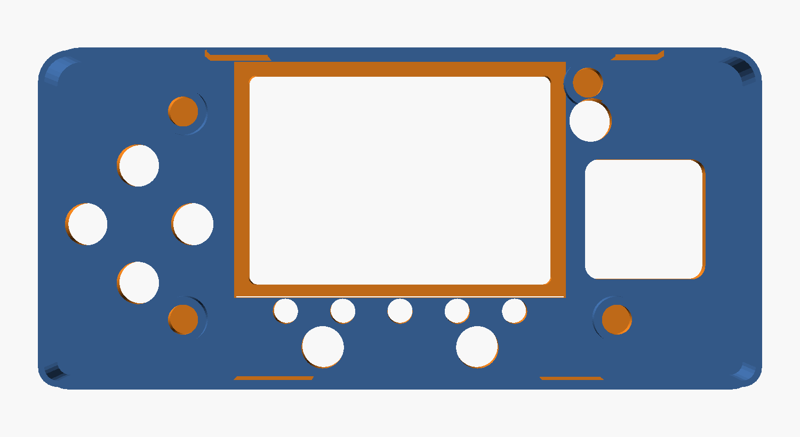
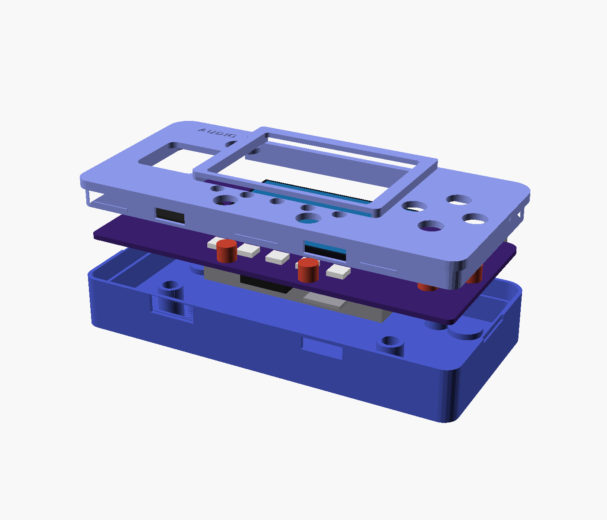
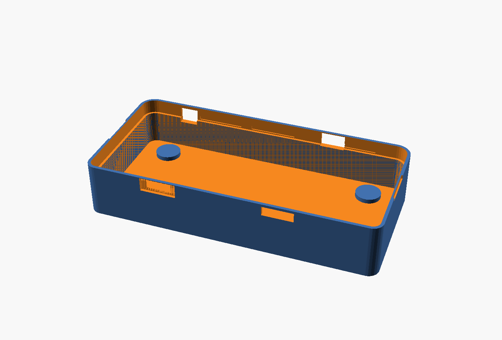
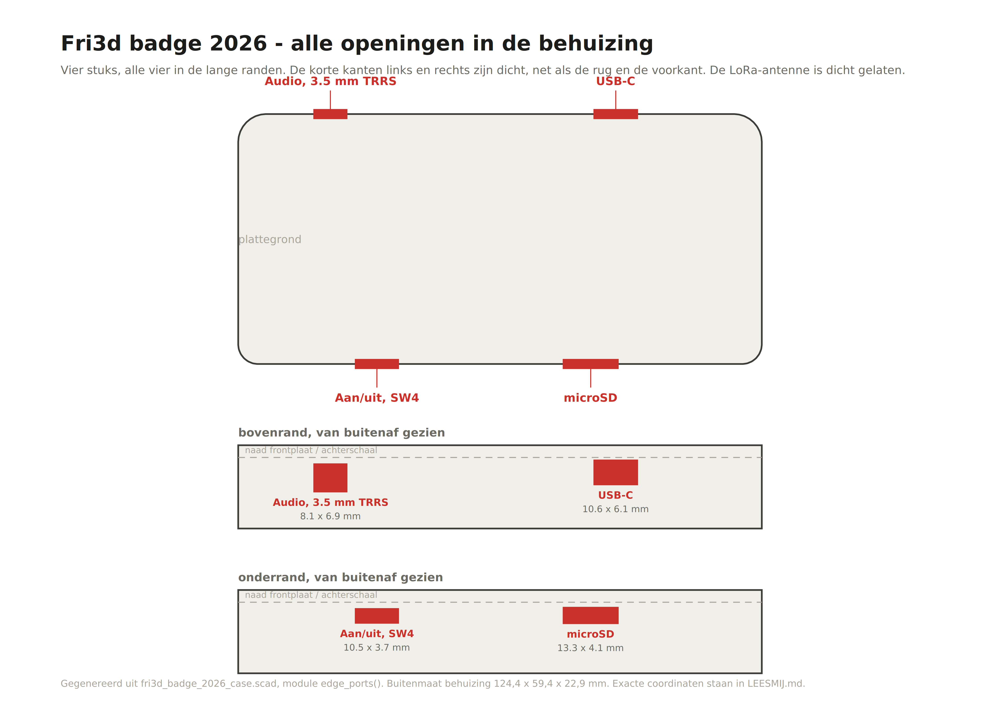
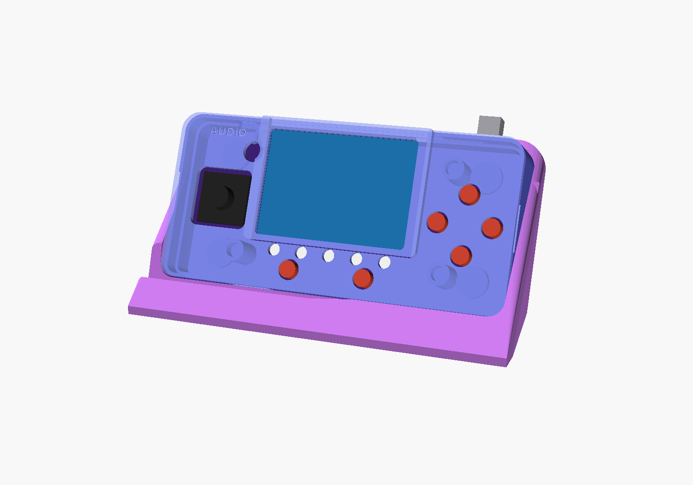
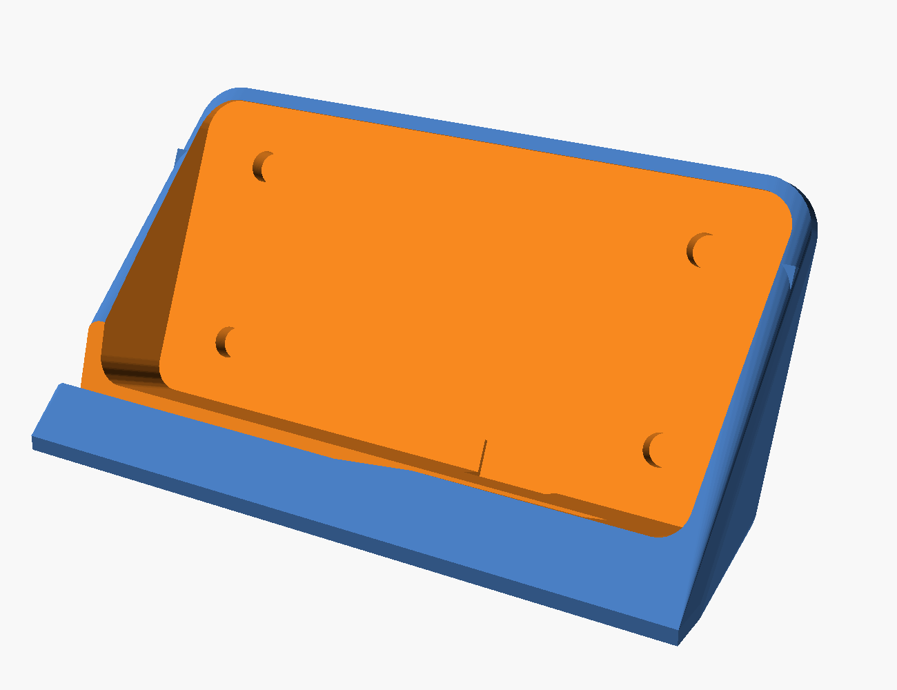
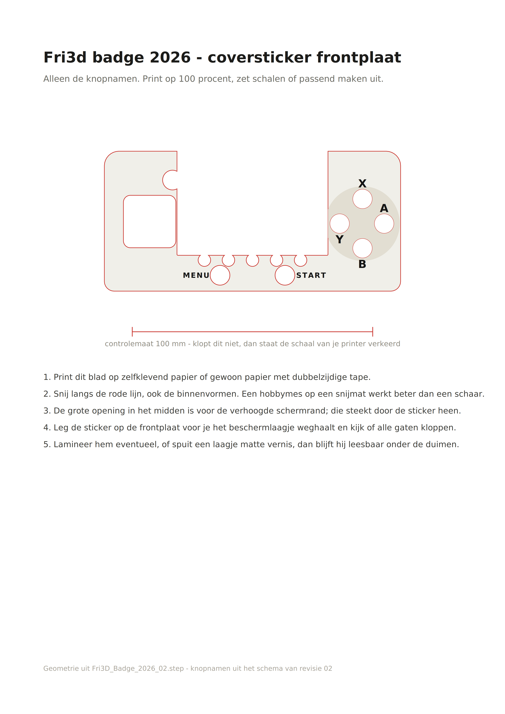

# Behuizing en magnetische bureaudock voor de Fri3d badge 2026

Revisie 02 van de badge. Alle maten komen uit `Fri3D_Badge_2026_02.step` uit
[Fri3dCamp/badge_2026_hw](https://github.com/Fri3dCamp/badge_2026_hw). De omtrek is uit de
board-solid gesneden, niet nagetekend, en de componenthoogtes zijn per onderdeel uit de
STEP gelezen.

Buitenmaat 124,4 x 59,4 x 29,1 mm. De badge zelf is 119 x 54 x 1,6 mm, met 7 mm joystick
boven de print. Onder de print zit de batterij van 7 mm en daaronder de cover-PCB op de
standoffs, die volgens de STEP tot z = -19,19 komen.

**Eerst dit getal nakijken.** Bovenaan `fri3d_badge_2026_case.scad` staat
`BADGE_BOTTOM = -19.19`. Dat is het laagste punt van alles wat aan de print hangt, gemeten
vanaf het bovenvlak van de print. De waarde komt uit de STEP en is de onderkant van de
standoffs M1..M4. Meet na hoe diep jouw stapel werkelijk is en zet dat getal erin; de
binnenvloer, de wanddikte en de dock volgen automatisch. Zit de cover-PCB er niet op, dan
volstaat -12,59 en wordt de behuizing 6,6 mm dunner.

Geen schroeven, geen zichtbare gaten en geen opschriften op de voorkant. De frontplaat
klikt vast en de rug is volledig dicht. Op de rug staat alleen FRI3D 2026, 0,6 mm diep;
`BACK_TEXT = false` haalt ook dat weg. `PORT_LABELS = true` zet AUDIO en LoRa terug in de
plaat, mocht je van gedacht veranderen.

## De klikverbinding

Rond de hele plaat loopt een tong van 1,05 mm dik die 6,4 mm diep in een gleuf in de
achterschaal valt. Die tong zit met 0,05 mm speling: een lichte pers, meer niet.

Het vasthouden gebeurt op **zes losse punten**, drie in de bovenrand en drie in de
onderrand. Daar zit een weerhaak van 0,4 mm op de tong, met een aanloopschuinte van 1,6 mm
eronder zodat de plaat er makkelijk op glijdt, en een vlak bovenvlak dat hem tegenhoudt.
De achterschaal heeft op precies die zes plekken een groef waar de weerhaak in terugveert.
Tussen die punten door zit de tong los, en dat is precies de bedoeling.

Op de twee **kopse kanten** zit een wrikgleufje van 16 x 3,2 mm, over de naad heen. Daar
steek je een spudger of een plectrum tussen en wrik je de plaat er weer af. Begin bij een
kopse kant, dan volgen de zes klikpunten vanzelf.

Voelt het te los of te vast na de eerste print, dan pas je `BEAD` bovenaan de bron aan.
0,3 mm is losjes, 0,5 mm zit stevig vast.

## De frontplaat

Alleen wat er echt door moet: het scherm, de joystick, de zes knoppen, vijf losse gaatjes
van 4,4 mm voor de RGB-LEDs, en het gaatje voor de status-LED. De LEDs zitten op x = -20,
-10, 0, 10 en 20, met het hart op y = -16,2.

De plaat is getrapt. Het hoofddek ligt 1,8 mm boven de PCB, zodat de knoppen er 1,2 mm
bovenuit steken en de joystick 3,5 mm. Alleen rond het display loopt het dek omhoog naar
6,5 mm; dat vormt de schermrand. Een vlak dek boven het displayniveau van 4,5 mm zou de
knoppen volledig begraven, vandaar de trap.

Op de vier montagegaten zit een ronde verdikking van 10 mm die 0,9 mm boven het dek
uitkomt, met daaronder een uitsparing van 7,0 mm voor de standoff. Er gaat niets doorheen
naar de voorkant.

## De binnenkant

Geen draagkolommen meer. De cover-PCB op de vier standoffs draagt de print al, dus de
behuizing hoeft daar niets te doen: de badge zakt als één geheel in de schaal en rust op
de vloer. Wat er wel staat zijn de vier verdikkingen rond de magneetnesten.

Aan de bovenkant steekt de standoff volgens de STEP 3,31 mm boven de print uit, met een
diameter van 6,2 mm. Het dek van de frontplaat ligt maar op 1,8 mm, dus daar zit nu een
uitsparing van 7,0 mm doorsnede tot 3,6 mm hoog. Om daar nog materiaal boven te houden
gaat het dek op die vier plekken 0,9 mm omhoog, als een ronde verdikking van 10 mm met een
afgeschuinde rand. Blijft er 1,1 mm materiaal over.

Die vier bultjes zijn de enige zichtbare vormen op de voorkant. Wil je ze niet, dan zijn de
alternatieven een lagere schroefkop op de badge, of een doorlopend gat van 7 mm in de plaat.
Zeg maar wat je liever hebt.

## De rug

Volledig dicht. Vier magneetnesten zitten binnenin, met 0,8 mm materiaal tussen magneet en
buitenvlak, zodat het vlak waar de dock tegenaan komt helemaal glad blijft.

**Let op, drie gevolgen van een dichte rug:**

- **SW11 is niet meer bereikbaar.** Dat is de ESP.RESET-knop, een tactschakelaar van
  4,5 x 4,5 mm aan de achterzijde. Resetten gaat via de USB-kabel of via de aan/uit-schuif.
- **De uitbreidingsconnector P10 (12 pins) zit dicht.** Wil je daar draadjes in kunnen
  steken, dan moet er alsnog een opening bij.
- **De buzzer heeft geen geluidspoort.** Hij zat al onder de batterij, dus veel maakt het
  niet uit, maar hij wordt wel doffer.

## Alle openingen

Vier stuks, alle vier in de lange randen. De korte kanten zijn dicht op de twee
wrikgleufjes na. `pdf/openingen_A4.pdf` is dezelfde tekening op A4.

| Opening | Rand | x van | x tot | Breedte | z van | z tot | Hoogte |
|---|---|---|---|---|---|---|---|
| Audio, 3,5 mm TRRS | boven | -44,35 | -36,25 | 8,10 | -7,40 | -0,50 | 6,90 |
| USB-C | boven | 22,20 | 32,80 | 10,60 | -5,70 | 0,40 | 6,10 |
| microSD | onder | 14,90 | 28,20 | 13,30 | -4,30 | -0,20 | 4,10 |
| Aan/uit, SW4 | onder | -34,50 | -24,00 | 10,50 | -4,20 | -0,50 | 3,70 |

De aan/uit-schakelaar is SW4, een Würth WS-SLSU 1P2T schuifschakelaar van 6,7 x 2,7 mm
aan de onderrand. De schuif steekt maar 0,88 mm voorbij de printrand, terwijl de wand
2,7 mm dik is, dus hij blijft 1,8 mm verzonken liggen. Daarom zit er rond de opening een
trechter van 15,5 x 6,1 mm die 1,3 mm diep in de buitenwand is uitgefreesd: zo kom je er
met een nagel bij. Voelt dat te krap, plak dan een sliertje filament van 2 mm op de schuif.

**De LoRa-antenne is dicht gelaten.** Dat kan alleen als de SMA-connector P3 niet
gemonteerd is: die steekt 9,5 mm voorbij de printrand en dan gaat de behuizing gewoon niet
dicht. Zet `LORA_PORT = true` bovenaan de bron als je hem wel hebt.

Gemeten vanaf het midden van de PCB, met z = 0 op het bovenvlak van de print. De
buitenkant van de rug ligt op z = -15,99, de bovenkant van het dek op z = 3,80.

Alle vier zitten deels in de frontplaat en deels in de achterschaal, want de naad tussen
beide ligt op z = 0,90. Dat is geen probleem: de uitsparing is uit beide delen gehaald.

## De dock

De badge klikt magnetisch in een ondiepe bak onder 65 graden. De bovenrand van de bak is
open, want USB-C en de audiojack steken voorbij de bovenrand van de print, en de
LoRa-connector zou dat met 9,5 mm nog veel meer doen.

Vier magneten in de dock staan precies tegenover die in de schaal. De opstaande rand vangt
het gewicht op, de magneten houden hem tegen de rug. Aan de badge verandert niets, dus
dezelfde vier magneten dragen straks ook een riemclip of een wandhouder.

Vier magneten van 6 x 3 mm is stevig. Als hij te vast zit, lijm er dan alleen twee in, de
buitenste twee.

## Coversticker

`pdf/coversticker_A4.pdf` is een A4 op ware grootte met alleen de knopnamen. Ze komen uit
het schema van revisie 02: SW7 is GAME.X, SW9 is GAME.B, SW5 is GAME.MENU en SW6 hangt aan
ESP.BOOT, dus dat is START. A en Y zijn afgeleid uit de labelposities in de mechanische
tekening en teruggerekend naar de knopcoordinaten: SW8 links is Y, SW10 rechts is A.

De sticker heeft de vorm van een U rond het scherm, want de verhoogde schermrand steekt er
doorheen. Op het blad staat een controlemaat van 100 mm, zodat je meteen ziet of je printer
op schaal staat. `pdf/coversticker.svg` is hetzelfde bestand voor een snijplotter.

## Onderdelen

| Onderdeel | Materiaal | Printstand | Supports |
|---|---|---|---|
| `stl/01_achterschaal.stl` | 32,9 cm3, ca. 41 g | rug op het bed | nee |
| `stl/02_frontplaat.stl` | 12,0 cm3, ca. 15 g | bovenkant op het bed | nee |
| `stl/03_dock.stl` | 60,8 cm3, ca. 75 g | plat, bak naar boven | nee |

Verder alleen 8 neodymium schijfmagneten van 6 x 3 mm nodig. Geen schroeven.

## Printinstellingen, Prusa MK4S in PLA

- Laaghoogte 0,2 mm, 3 perimeters, 20 procent gyroid
- Geen supports nodig in de aangegeven standen
- De frontplaat print met de zichtzijde op het bed. De schermrand wordt dan het gladste
  vlak, de holte eronder is een opening naar boven in plaats van een brug van 58 mm, de
  opschriften komen in de eerste laag, en de weerhaken bouwen zich op met de schuinte naar
  onder. Alleen het vlakke bovenvlak van elke weerhaak is een overhang van 0,4 mm, en dat
  overbrugt de MK4S zonder morren.
- De weerhaken zijn opgebouwd uit laagjes van 0,2 mm. Print je op een andere laaghoogte,
  dan blijft het werken, maar 0,2 geeft de netste schuinte.

## Montage

1. Draai de vier bestaande standoffs van de badge af en haal de coverprint onder de
   batterij weg. De behuizing neemt die rol over.
2. Lijm vier magneten in de achterschaal, alle vier met dezelfde pool naar buiten.
3. Lijm vier magneten in de dock met de tegenovergestelde pool naar boven. Test met de
   badge erop voor je lijmt.
4. Leg de batterij op de bodem, daarna de PCB op de vier kolommen. De connectoren vallen
   vanzelf in de uitsparingen.
5. Zet de frontplaat erop en druk hem rondom aan tot je de zes klikpunten voelt inhaken.
6. Sticker uitsnijden en op de frontplaat leggen om te controleren voor je hem plakt.

Openmaken: spudger in een van de twee wrikgleufjes op de kopse kanten, langs de rand
werken.

## Nog niet fysiek getest

De pasvorm is numeriek gecontroleerd: de behuizing is booleaans doorsneden met alle
componentvolumes uit de STEP, en de overlap is nul, ook bij de USB-C, de audiojack, de
LoRa-connector en de microSD. Achterschaal tegen frontplaat geeft eveneens nul. De
klikverbinding is nagemeten door punten af te tasten in beide meshes: tong 1,05 mm in een
gleuf van 1,10 mm, weerhaak 0,4 mm, met de vergrendeling op z = -2,90 en 0,10 mm speling.

Maar printkrimp is niet gesimuleerd, en een klikverbinding is nu eenmaal het soort ding dat
je een keer moet voelen. Print eerst de frontplaat alleen. Vijftien gram, en je weet meteen
of de knopgaten, het schermvenster en de klikdruk kloppen. Bovenaan
`fri3d_badge_2026_case.scad` staan `FIT` voor de speling rond de PCB en `BEAD` voor de
klikdruk.

## Fout die onderweg gevonden is

Tot en met versie 4 werden de vier draagkolommen en de vier magneetverdikkingen in de
achterschaal per ongeluk weggesneden: de binnenholte werd afgetrokken nadat ze aangemaakt
waren, en die aftrekking nam ze mee. Gevolg: er stond niets onder de PCB en de magneetnesten
waren maar 1,6 mm diep in plaats van 3,2, zodat een magneet van 3 mm 1,4 mm zou uitsteken.
Dat is nu rechtgezet door de holte eerst uit de schaal te snijden en de kolommen daarna toe
te voegen. Als je al iets geprint had, gooi die achterschaal weg.

## Bron en opnieuw bouwen

`./build.sh` bouwt de drie STL's en de twee PDF's opnieuw en draait meteen de drie
botsingscontroles. Nodig: `openscad`, en `python3` met `shapely` en `cairosvg`.

Alles komt uit een file: `fri3d_badge_2026_case.scad`. Zet `part` op `"backshell"`,
`"frontplate"`, `"dock"`, `"assembly"`, `"docked"`, `"exploded"`, `"plated"` of
`"section"`. De onderdelen `"check"`, `"check2"` en `"check3"` zijn de botsingscontroles;
die horen leeg te blijven.

`BACK_SCREWS = true` voegt alsnog vier M2 vanaf de rug toe, als de klikverbinding tegenvalt.

`make_sticker.py` en `make_ports.py` genereren de sticker en de openingentekening uit
dezelfde constanten. Wijzig je de behuizing, draai die twee dan ook opnieuw.
