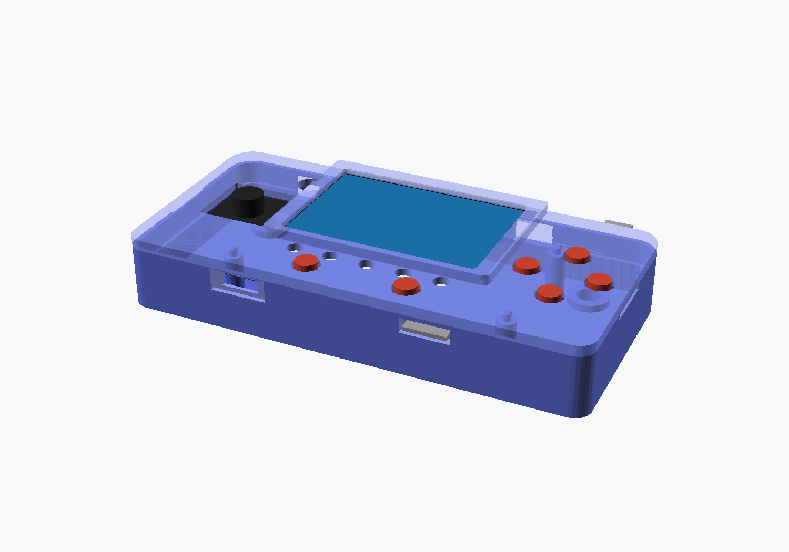
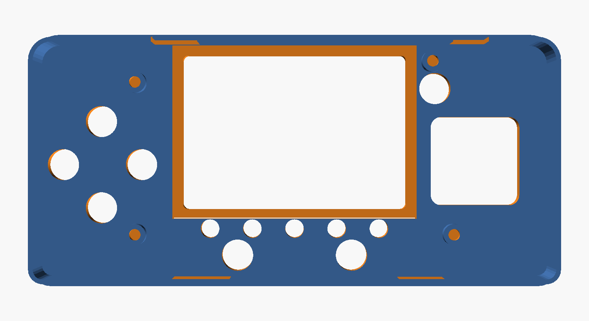
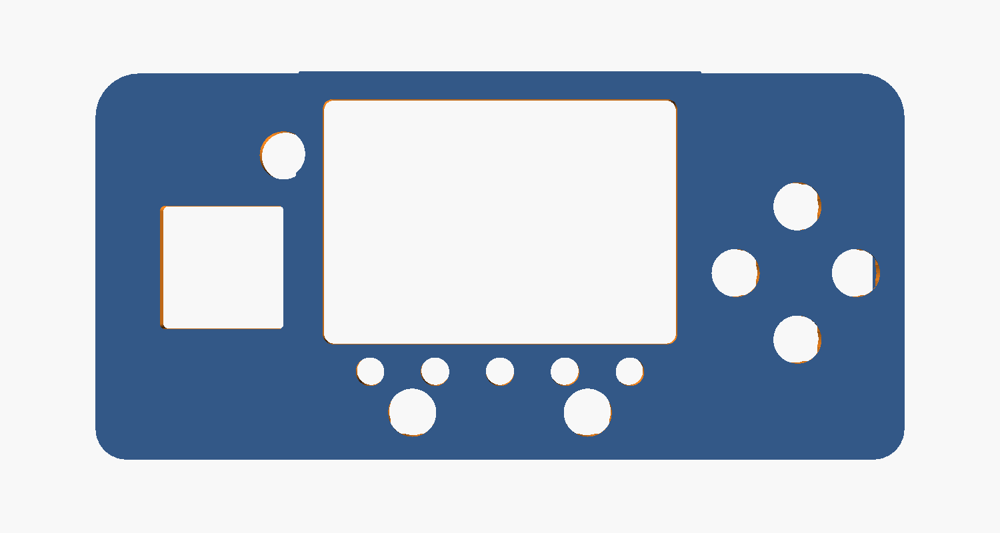
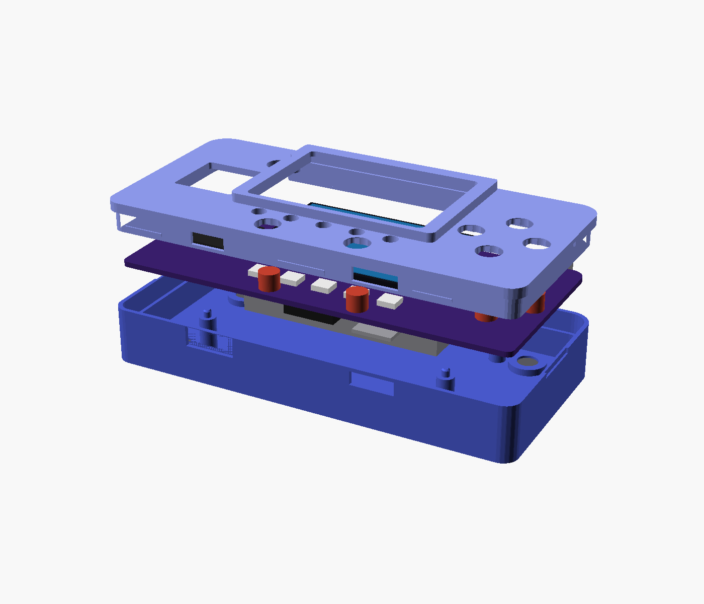
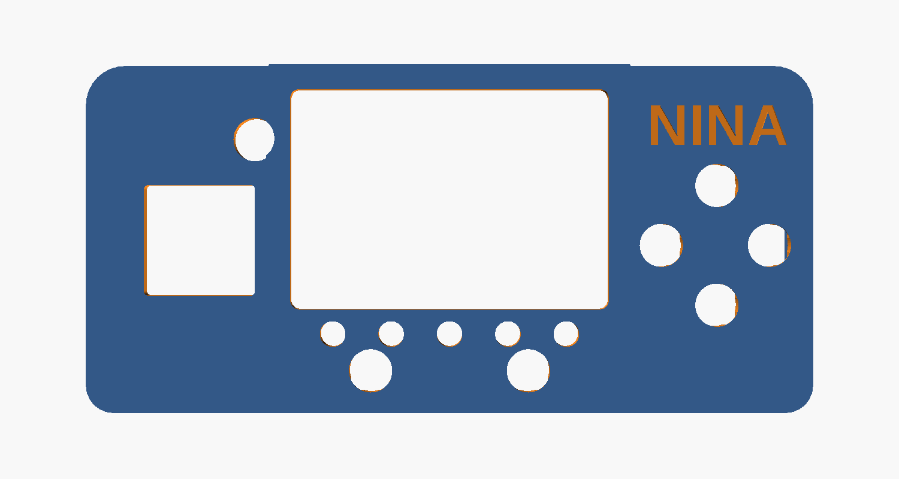
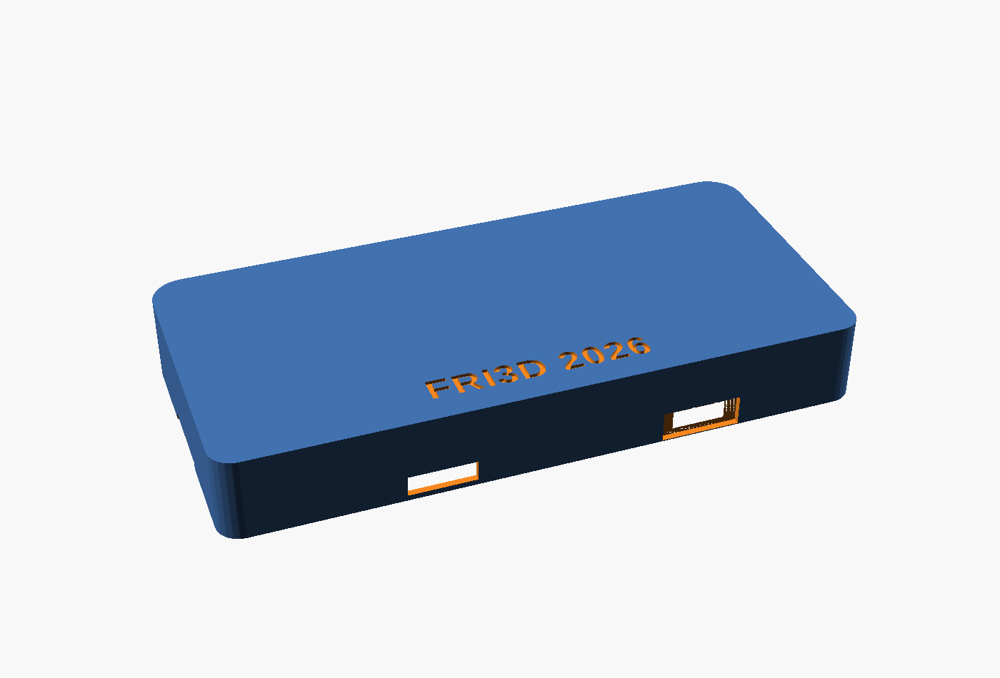
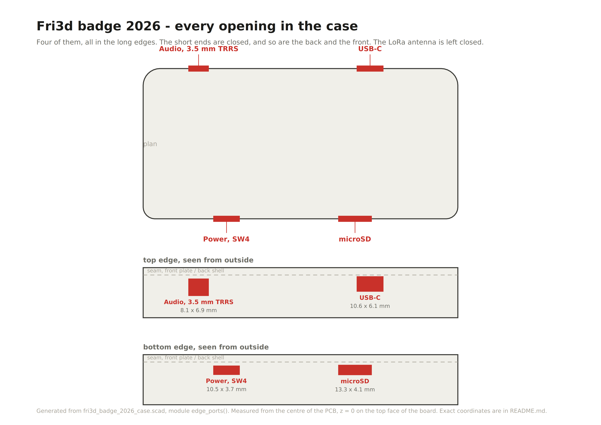
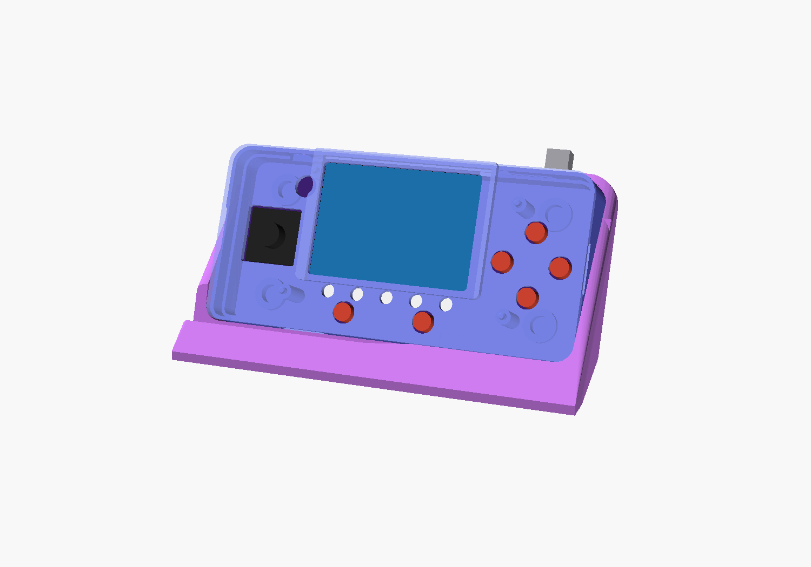
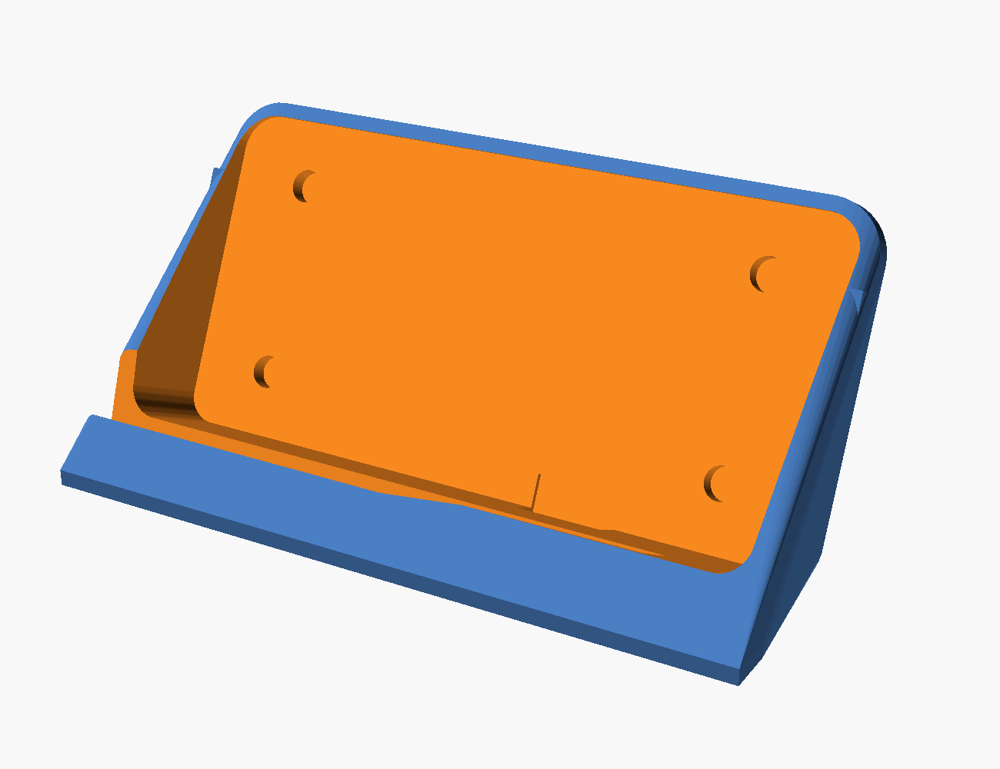
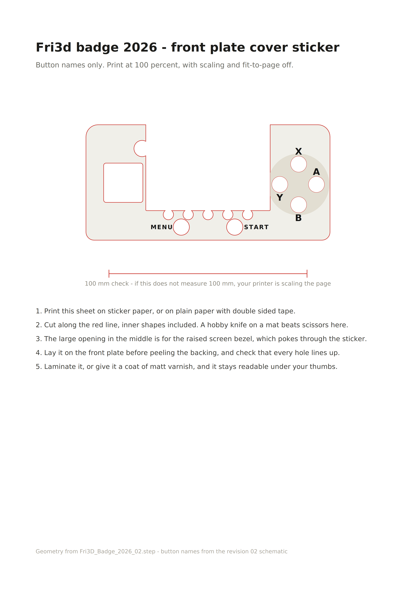

# A case and a magnetic desk dock for the Fri3d badge 2026

Revision 02 of the badge. Every dimension comes from `Fri3D_Badge_2026_02.step` in
[Fri3dCamp/badge_2026_hw](https://github.com/Fri3dCamp/badge_2026_hw). The outline is cut
from the board solid rather than redrawn, and each component height is read from that same
file, per designator.



Outside 124.4 x 59.4 x 22.5 mm. The badge itself is 119 x 54 x 1.6 mm, with the joystick
7 mm above the board and the 7 mm battery below it.

The badge's own standoffs and cover PCB come off. The case carries the board instead, on
four columns of its own, and that is what keeps it this thin. Under the board there is
12.0 mm of clear space, which is the battery plus a millimetre.

`BADGE_BOTTOM` at the top of `fri3d_badge_2026_case.scad` is the lowest point of anything
hanging under the board, measured from its top face. It is -12.59, the bottom of the
battery according to the STEP. Change that one number and the inner floor, the wall and
the dock all follow.

No screws, no visible holes and no lettering anywhere. The front plate clips on and the
back is fully closed and blank. `BACK_TEXT = true` embosses FRI3D 2026 into the back,
0.6 mm deep, `PORT_LABELS = true` puts AUDIO and LoRa into the front plate, and
`FRONT_NAME` engraves a name above the buttons. All three are off by default.

## The clip joint



A 1.05 mm tongue runs all the way around the plate and drops 6.4 mm into a groove in the
back shell. It has 0.05 mm of clearance: a light press, nothing more.

The holding is done at **six separate points**, three in the top edge and three in the
bottom. Each is a 0.4 mm barb on the tongue with a 1.6 mm lead-in ramp below it, so the
plate slides on easily, and a flat top face that stops it coming back. The back shell has
a groove at exactly those six spots for the barb to spring into. Between them the tongue
is free, which is the point.

Each **short end** has a 16 x 3.2 mm pry slot across the seam. Put a spudger or a guitar
pick in there and lever the plate off. Start at a short end and the six clips follow.

If it feels too loose or too tight after the first print, change `BEAD` at the top of the
source. 0.3 mm is easy, 0.5 mm holds hard.

## The front plate



Only what genuinely has to pass through: the screen, the joystick, the six buttons, five
separate 4.4 mm holes for the RGB LEDs and one for the status LED. The LEDs sit at
x = -20, -10, 0, 10 and 20, centred on y = -16.2.

The plate is stepped. The main deck is 1.8 mm above the board, so the buttons stand 1.2 mm
proud and the joystick 3.5 mm. Only around the display does it rise to 6.5 mm to form the
bezel. A flat deck above the 4.5 mm display would bury every control, which is the whole
reason for the step.

### The buttons need more than a round hole

The switches are Alps SKPMAM. Sliced out of the STEP, the body is 5.94 x 5.90 mm and runs
up to z = 3.50; above that sits a cap of 4.97 x 4.87 tapering to 4.50 at z = 5.00.

The cap goes through a 7.4 mm round hole without trouble. The body does not: its corners
reach 4.19 mm from the centre against a hole radius of 3.70. Push the plate on and the
deck lands on the four corners of every switch. On the first print that tore a switch off
the board.

So each button has two cuts. The round 7.4 mm hole through the whole deck, which is all
you see from outside, and a 7.0 x 7.0 mm relief with 1 mm corners cut up from underneath
to z = 3.60. Only the four corners of that relief fall outside the round hole, and above
them 0.20 mm of deck is left, a single layer at 0.2 mm. It is a cosmetic skin and nothing
more. If it tears, raise `FWALL` or set `BTN_BODY_TOP = DECK_Z1` and let the relief break
right through; the holes then read as rounded squares.

There are 1.40 mm to divide between that skin and how far the button stands proud, and
nothing can change that: the body top is at 3.50 and the cap top at 5.00.

### The joystick and the screen

P7 is a block of 18.0 x 18.0 mm running up to z = 5.60, with a 2 mm stick above it. The
opening is 19.0 x 19.0 with 0.8 mm corners. The corner radius matters as much as the size:
at 2.5 mm the arc cuts straight across the square corners of the block, which is what the
old 21 x 21 opening did.

The clearance pocket for the display is built from `DISP_X0`, `DISP_X1`, `DISP_Y0` and
`DISP_Y1` at the top of the source, which are the glass edges from the STEP, plus `DISP_CL`
of 0.6 mm at the sides and the bottom and `DISP_CL_T` of 1.4 mm at the top. The top gets
more because that is the side the module is hardest to drop into. The pocket used to run to
y = 30.10, straight out through the top wall, which left a 57.8 mm slot along the back edge
with nothing over it but the bezel. It now ends at 28.00 and leaves a 1.7 mm rim. There is
room for more if you need it: the wall under the deck starts at 28.40, so anything up to
that still closes.

Behind each mounting hole is a 5 mm column that presses the board down onto the one in the
shell. Nothing sticks out above the board, so the deck stays flat and unbroken.



## Putting a name on it



`FRONT_NAME` engraves a name into the top right of the plate, above the buttons, 0.5 mm
deep. Empty by default.

```
openscad -o front_plate_NINA.stl --export-format binstl \
         -D 'part="frontplate"' -D 'FRONT_NAME="NINA"' fri3d_badge_2026_case.scad
NAME=NINA python3 make_sticker.py
```

Engraved rather than raised, because the visible face of the plate goes on the bed. A
recess prints as a void in the first few layers; raised letters would have to hang below
the bed. `NAME_POS`, `NAME_SIZE` and `NAME_DEPTH` move and resize it. The free deck runs
from x = 32 to 60 and y = 13 to 27, between the bezel, the buttons and the edge.

`named/` holds a plate and a matching sticker with NINA on them.

## Inside


Four columns stand where the badge's own spacers used to be, on the four mounting holes.
They are 5.0 mm across, which is as wide as they can get before they touch components, and
12.0 mm tall, ending flush with the underside of the board.

Each one carries a 2.3 mm pin that goes up through the 2.5 mm mounting hole and stands
0.6 mm above the board. The tip is chamfered, so the board drops onto the four pins without
fishing for the holes, and once it is on it cannot shift. The front plate has a matching
column with a blind hole for the pin, so it clamps the board rather than the pin.

Because nothing sticks out above the board any more, the front of the plate is completely
flat. Widen `COL_D` at your peril: above 5.0 mm the columns start meeting components.

Next to the columns stand the four bosses around the magnet pockets, 11 mm across and
2 mm tall. They are rings, not discs: the pocket is 3.2 mm deep, deeper than the 2.4 mm
wall, so it has to break through the top of the boss. Drop the magnet in from the inside
and it lands on 0.8 mm of skin.

## The back



Fully closed. Four magnet pockets sit inside with 0.8 mm of material between the magnet
and the outer face, so the surface the dock meets stays perfectly flat.

**Three consequences of a closed back:**

- **SW11 is no longer reachable.** That is the ESP.RESET button, a 4.5 x 4.5 mm tact
  switch on the back. Reset over USB, or with the power slider.
- **The expansion connector P10 (12 pins) is covered.** If you want wires in there, it
  needs an opening.
- **The buzzer has no sound port.** It already sat under the battery, so it does not
  change much, but it does get duller.

## Every opening



Four of them, all in the long edges. The short ends are closed apart from the two pry
slots. `pdf/openings_A4.pdf` is the same drawing at A4.

| Opening | Edge | x from | x to | Width | z from | z to | Height |
|---|---|---|---|---|---|---|---|
| Audio, 3.5 mm TRRS | top | -44.35 | -36.25 | 8.10 | -7.40 | -0.50 | 6.90 |
| USB-C | top | 22.20 | 32.80 | 10.60 | -5.70 | 0.40 | 6.10 |
| microSD | bottom | 14.90 | 28.20 | 13.30 | -4.30 | -0.20 | 4.10 |
| Power, SW4 | bottom | -34.50 | -24.00 | 10.50 | -4.20 | -0.50 | 3.70 |

The power switch is SW4, a Würth WS-SLSU 1P2T slide switch of 6.7 x 2.7 mm on the bottom
edge. Its slider only reaches 0.88 mm past the board edge while the wall is 2.7 mm thick,
so it sits 1.8 mm recessed. That is why the opening has a 15.5 x 6.1 mm funnel milled
1.3 mm into the outer wall: a fingernail can reach it. If that still feels tight, glue a
2 mm sliver of filament onto the slider.

**The LoRa antenna is left closed.** That only works if the SMA connector P3 is not
fitted: it sticks out 9.5 mm past the board edge and the case simply will not close over
it. Set `LORA_PORT = true` at the top of the source if you have it.

Measured from the centre of the PCB, with z = 0 on the top face of the board. The outside
of the back is at z = -15.99 and the top of the deck at z = 3.80.

All four openings sit partly in the front plate and partly in the back shell, because the
seam between them is at z = 0.90. That is not a problem: the cut-out is subtracted from
both parts.

## The dock





The badge clips magnetically into a shallow tray at 65 degrees. The top edge of the tray
is open, because USB-C and the audio jack reach past the top edge of the board, and the
LoRa connector would do so by a further 9.5 mm.

Four magnets in the dock sit exactly opposite the four in the shell. The standing rim
takes the weight, the magnets hold it against the back. Nothing on the badge changes, so
the same four magnets will carry a belt clip or a wall mount later.

Four 6 x 3 mm magnets is a firm hold. If it grips too hard, glue in only two, the outer
pair.

## Cover sticker



`pdf/cover_sticker_A4.pdf` is an A4 at true size with the button names on it. They come
from the revision 02 schematic: SW7 is GAME.X, SW9 is GAME.B, SW5 is GAME.MENU, and SW6
hangs on ESP.BOOT, which makes it START. A and Y are derived from the label positions in
the mechanical drawing and cross-checked against the button coordinates: SW8 on the left
is Y, SW10 on the right is A.

The sticker is a U around the screen, because the raised bezel pokes through it. The sheet
carries a 100 mm check line so you can see at a glance whether your printer is scaling the
page. `pdf/cover_sticker.svg` is the same file for a cutting plotter.

## Parts

| Part | Material | Orientation | Supports |
|---|---|---|---|
| `stl/01_back_shell.stl` | 28.3 cm3, about 35 g | back on the bed | no |
| `stl/02_front_plate.stl` | 12.7 cm3, about 16 g | top face on the bed | no |
| `stl/03_dock.stl` | 58.3 cm3, about 72 g | flat, tray upwards | no |

Beyond that you need eight 6 x 3 mm neodymium disc magnets. No screws.

## Print settings, Prusa MK4S in PLA

- 0.2 mm layers, 3 perimeters, 20 percent gyroid
- No supports needed in the orientations above
- Print the front plate with its visible face on the bed. The bezel then comes out as the
  smoothest surface, the cavity under it is an opening upwards instead of a 58 mm bridge,
  and the barbs build up with their ramp facing down. Only the flat top face of each barb
  is an overhang, 0.4 mm, which the MK4S bridges without complaint.
- The barbs are built from 0.2 mm slices. Other layer heights still work, but 0.2 gives
  the cleanest ramp.

## Assembly

1. Take the badge's four standoffs and its cover PCB off. The case takes over that job.
2. Glue four magnets into the back shell, all four with the same pole facing out.
3. Glue four magnets into the dock with the opposite pole facing up. Test with the badge
   on top before the glue goes anywhere.
4. Lay the battery on the floor of the shell, then drop the board onto the four pins. The
   connectors land in their openings on their own.
5. Put the front plate on and press it down all round until you feel the six clips engage.
6. Cut out the sticker and lay it on the plate to check before you stick it.

To open it: spudger into one of the two pry slots on the short ends, then work along the
edge.

## What the first print taught us

The first version was printed and assembled, and it found three things the numbers had
not.

**The plate rested on the square switch bodies.** Fixed as described above. This is the
one that matters, because a plate sitting 1.7 mm high cannot seat, which means the clip
joint was never fairly tested either.

**The joystick opening was 21 x 21 with 2.5 mm corners.** Now 19 x 19 with 0.8 mm corners.

**The display pocket ran out through the top wall.** Now bounded to the glass.

All three were invisible to the interference check, because the check model was wrong in
exactly the places that mattered: the buttons were 6 mm cylinders instead of square bodies,
and the joystick was an 18 x 18 slab that stopped at z = 1.75 with a thin cylinder above
it. A check is only worth the model it runs against. Both are now taken from slices
through the STEP, and the check caught the joystick corners on the first rebuild.

The clip joint is deliberately unchanged: judge it again now that the plate can actually
go down. If it still gives, `BEAD` at the top of the source sets the pressure, 0.5 holds
hard, and `bead_spots` sets how many points hold. `BACK_SCREWS = true` adds four M2 from
the back.

The rest is still numbers only. The case is boolean-intersected with every component
volume from the STEP and the overlap is zero, including the USB-C, the audio jack, the
LoRa connector and the microSD. Back shell against front plate is zero as well. The clip
joint was measured by probing points in both meshes: a 1.05 mm tongue in a 1.10 mm groove,
a 0.4 mm barb, locking at z = -2.90 with 0.10 mm of play.

## Building it again

`./build.sh` rebuilds the three STLs, both PDFs and all ten images in `images/`, and runs
the three interference checks plus a sealed-void check. It needs `openscad`, and `python3`
with `shapely` and `cairosvg`; add `trimesh` and the checks report a volume instead of just
saying the file is not empty. Run it after any change to the source, otherwise the pictures
in this file quietly start describing an older design.

The sealed-void check exists because the magnet pockets were once closed over the top by
0.4 mm. The part was watertight, the interference checks were clean and the render looked
right, but the magnets could never have gone in. A pocket that does not reach a surface is
now a build failure.

About that second check: `check2` intersects the back shell with the front plate and comes
out non-empty but with zero volume. That is not an interference. The two parts touch along
the seam and the boolean leaves coincident-surface slivers there. Only the volume matters,
which is why the script measures it rather than looking at the file size.

Everything comes from one file: `fri3d_badge_2026_case.scad`. Set `part` to `"backshell"`,
`"frontplate"`, `"dock"`, `"assembly"`, `"docked"`, `"exploded"`, `"plated"` or
`"section"`. The parts `"check"`, `"check2"` and `"check3"` are the interference checks and
are supposed to come out empty.

`BACK_SCREWS = true` adds four M2 from the back if the clip joint disappoints.

`make_sticker.py` and `make_ports.py` generate the sticker and the openings drawing from
the same constants. Change the case and you should rerun both.
